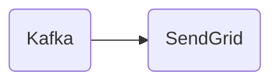

# Connect Kafka to SendGrid

Quix helps you integrate Kafka to SendGrid using pure Python.

- __Find out how we can help you integrate!__

    <a class="md-button md-button--primary" href="https://share.hsforms.com/1iW0TmZzKQMChk0lxd_tGiw4yjw2?__hstc=175542013.2303933fbd746c0ac86d9ccbe9bc9100.1728383268831.1729603416735.1729620918855.31&__hssc=175542013.1.1729620918855&__hsfp=2132701734" target="_blank" style="margin:.5rem;">Book a demo</a>

## SendGrid

SendGrid is a cloud-based email service provider that helps businesses send transactional and marketing emails. It offers a reliable and scalable platform designed to ensure email delivery rates are high and messages reach customers' inboxes. SendGrid provides features such as detailed analytics, email template customization, spam filtering, and email testing to optimize email marketing campaigns. Its easy-to-use interface and robust infrastructure make it a popular choice for companies looking to streamline their email communication processes and improve engagement with their audience. With SendGrid, businesses can confidently send personalized and targeted emails while monitoring performance metrics to track the success of their campaigns.

## Integrations

Quix is a good fit for integrating with SendGrid because of its robust capabilities for developing, deploying, and managing real-time data pipelines. Quix Cloud provides streamlined development and deployment features, enhanced collaboration tools, real-time monitoring capabilities, flexible scaling and management options, and robust CI/CD processes. These features align well with the requirements for integrating with SendGrid, which likely involves processing and managing large volumes of data in real-time.

Additionally, Quix Streams, a cloud-native library for processing data in Kafka using Python, offers further benefits for integrating with SendGrid. The library operates without a server-side engine, integrates seamlessly with the Python ecosystem, and supports serialization and state management, time window aggregations, and resilient scaling. This makes it an ideal tool for efficiently processing and handling data from SendGrid within the Quix platform.

Overall, the combination of Quix's comprehensive platform for developing and managing data pipelines and Quix Streams' capabilities for processing data in Kafka using Python make it a strong fit for integrating with SendGrid and effectively managing the data generated by the technology.

