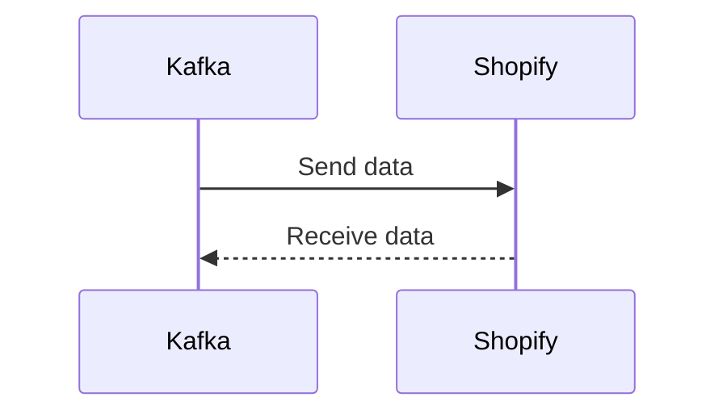

# Connect Kafka to Shopify

Quix helps you integrate Kafka to Shopify using pure Python.

## Shopify

Shopify is a popular e-commerce platform that allows businesses to easily set up and operate online stores. It provides businesses with a user-friendly interface for designing their store, managing products, processing payments, and tracking orders. Shopify also offers a range of customizable templates and tools to help businesses create a professional and high-converting online store. Additionally, Shopify provides features such as built-in marketing tools, analytics, and integration with popular third-party apps and services to help businesses grow and scale their online presence. Overall, Shopify is a powerful and versatile technology that enables businesses of all sizes to sell products online efficiently and effectively.

## Integrations

Shopify is a popular e-commerce platform that enables businesses to set up online stores and sell products. Integrating Quix with Shopify can provide substantial benefits for businesses looking to process real-time data and automate various tasks related to their e-commerce operations.

Here's why Quix is a good fit for integrating with Shopify:

1. Real-Time Data Processing: Quix Streams and Quix Cloud are designed to handle real-time data processing efficiently. With Shopify generating large amounts of data related to sales, customer interactions, and inventory management, having a platform that can process this data in real-time can help businesses make better decisions and respond to market changes quickly.

2. Flexibility and Scalability: Shopify businesses can experience fluctuations in data volume based on seasonal trends, promotions, or marketing campaigns. Quix Streams and Quix Cloud offer flexible scaling capabilities that allow businesses to adjust resources based on their needs. This ensures that businesses can handle varying data loads without compromising on performance.

3. Data Analysis and Visualization: With features for data exploration and visualization, Quix Cloud can help Shopify businesses gain valuable insights from their data. By analyzing data in real-time, businesses can better understand customer behavior, track sales performance, and optimize their marketing strategies.

4. CI/CD Integration: Quix Cloud's robust CI/CD processes make it easy to integrate with GitHub and streamline deployment workflows. This can be particularly beneficial for Shopify businesses that rely on continuous deployment practices to roll out updates and new features to their online stores.

5. Python Integration: Quix Streams' seamless integration with Python can be advantageous for Shopify businesses that use Python for their data analysis and machine learning tasks. The ability to leverage Python libraries like Pandas and scikit-learn can enhance data processing capabilities and enable businesses to derive valuable insights from their Shopify data.

Overall, integrating Quix with Shopify can empower businesses to leverage real-time data processing, scalable infrastructure, and powerful data analysis tools to enhance their e-commerce operations and drive business growth.

