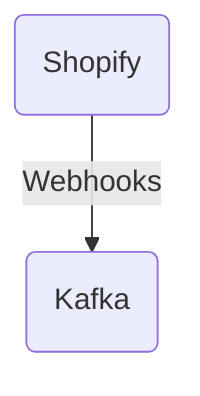

# Connect Kafka to Shopify

Quix helps you integrate Kafka to Shopify using pure Python.

- __Find out how we can help you integrate!__

    <a class="md-button md-button--primary" href="https://share.hsforms.com/1iW0TmZzKQMChk0lxd_tGiw4yjw2?__hstc=175542013.2303933fbd746c0ac86d9ccbe9bc9100.1728383268831.1729603416735.1729620918855.31&__hssc=175542013.1.1729620918855&__hsfp=2132701734" target="_blank" style="margin:.5rem;">Book a demo</a>

## Shopify

Shopify is a popular e-commerce platform that allows businesses to create and manage online stores. It provides a user-friendly interface that makes it easy for anyone to set up and customize their store without needing any coding knowledge. Shopify offers a variety of features, including secure payment processing, inventory management, and marketing tools. It also integrates with various third-party applications and services to help streamline the online selling process. With Shopify, businesses can reach a wider audience and sell their products or services online efficiently and effectively.

## Integrations

Quix is a good fit for integrating with Shopify because of its comprehensive platform designed for developing, deploying, and managing real-time data pipelines. 

1. Streamlined Development and Deployment: Quix's integrated online code editors and CI/CD tools simplify the creation and deployment of data pipelines, making it easier for Shopify developers to work on their projects efficiently.

2. Enhanced Collaboration: By supporting efficient collaboration with organization and permission management, Quix allows for increased project visibility and control, which is crucial for a platform like Shopify that requires multiple teams to work together.

3. Real-Time Monitoring: Quix Cloud provides tools for real-time logs, metrics, and data exploration, allowing Shopify users to monitor pipeline performance and critical metrics in real-time to optimize their operations.

4. Flexible Scaling and Management: With Quix, Shopify users can easily scale resources, manage CPU and memory, and handle multiple environments linked to Git branches, providing the scalability and flexibility needed for an e-commerce platform like Shopify.

5. Security and Compliance: Quix ensures secure management of secrets and compliance with dedicated infrastructure options and SLAs, which is essential for a platform that deals with sensitive customer data like Shopify.

In addition, Quix Streams, a cloud-native library for processing data in Kafka using Python, also offers benefits like no JVM required, seamless integration with the Python ecosystem, support for serialization and state management, time window aggregations, resilient scaling, and local and Jupyter Notebook support, making it a valuable tool for Shopify developers working with data in Kafka. This integration would enhance the capabilities of Shopify's data processing and analytics tasks, making it a seamless and efficient process for the platform.

