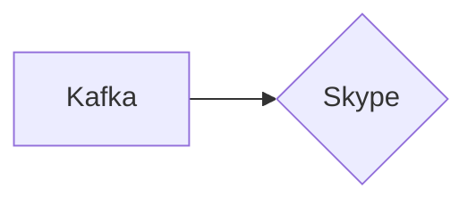

# Connect Kafka to Skype

Quix helps you integrate Kafka to Skype using pure Python.

## Skype

Skype is a telecommunications application that allows users to make voice and video calls over the internet. Originally released in 2003, Skype has grown to become one of the most popular and widely used communication platforms in the world. Users can communicate with other Skype users for free, or they can make low-cost calls to landline and mobile phones. In addition to voice and video calls, Skype also offers instant messaging, file sharing, and screen sharing features. The platform is available on a wide range of devices, including smartphones, tablets, computers, and smart TVs, making it easy for users to stay connected no matter where they are. Overall, Skype has revolutionized the way people communicate and has made it easier than ever to stay in touch with friends, family, and colleagues around the world.

## Integrations

Quix is a good fit for integrating with Skype because of its real-time data processing capabilities and scalability. Skype users often engage in real-time communication and data sharing, making the ability to process and analyze data quickly and efficiently crucial for enhancing user experience and providing valuable insights.

Quix Streams' features such as time window aggregations, serialization, and state management would be beneficial for processing and analyzing real-time data from Skype conversations. The platform's resilience and scalability make it well-suited for handling the large volume of data generated by Skype users.

Additionally, Quix Streams' integration with Kafka and Python ecosystem would allow for seamless integration with Skype's data streams. The platform's support for container orchestration and Jupyter Notebook would facilitate easy development and debugging of data pipelines for Skype data processing.

Overall, Quix would offer a comprehensive and efficient solution for integrating with Skype to enhance data processing, analysis, and overall user experience.

