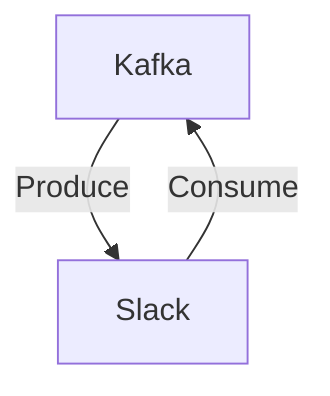

# Connect Kafka to Slack

Quix helps you integrate Kafka to Slack using pure Python.

## Slack

Slack is a popular cloud-based messaging platform that is designed to streamline communication and collaboration within organizations. It allows users to create different channels for specific projects, teams, or topics, where they can share messages, files, and updates. Slack also offers features such as direct messaging, video calls, and integrations with other productivity tools, making it a comprehensive solution for remote or dispersed teams. With its user-friendly interface and powerful search function, Slack helps to reduce the need for lengthy email chains and promotes real-time, efficient communication among team members. Overall, Slack is a valuable tool for improving teamwork and productivity in modern workplaces.

## Integrations

Quix would be a good fit for integrating with Slack because of its real-time data processing capabilities and seamless Python integration. 

With Quix Streams, users can easily process and analyze data from Kafka using Python, a popular and widely-used programming language. This makes it easy for developers and data scientists familiar with Python to work with real-time data streams and perform complex data operations.

Furthermore, Quix Cloud's features such as real-time monitoring, streamlining development and deployment, and enhanced collaboration make it a perfect platform for integrating with Slack. By leveraging Quix Cloud, users can create and manage real-time data pipelines efficiently, collaborate with team members in a structured way, and monitor pipeline performance in real-time.

Integrating with Slack would enable teams to receive notifications and updates on the status of their data pipelines, collaborate on projects seamlessly, and stay informed about critical metrics and performance. This integration would enhance team communication, streamline workflows, and improve overall productivity.

Overall, the combination of Quix with Slack would provide a powerful and efficient solution for processing real-time data and collaborating effectively within teams.

