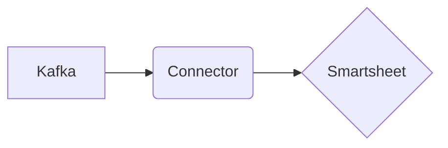

# Connect Kafka to Smartsheet

Quix helps you integrate Kafka to Smartsheet using pure Python.

## Smartsheet

Smartsheet is a cloud-based work management platform that allows users to collaborate, track, and manage projects and tasks in real-time. It provides a variety of tools and features to help teams streamline their workflow, allocate resources efficiently, and monitor progress towards project goals. With Smartsheet, users can create customizable sheets and reports, set up automated workflows, and communicate with team members through comments and notifications. The platform also offers integration with popular business tools such as Microsoft Office, Google Suite, and Salesforce, making it easy for users to incorporate Smartsheet into their existing workflows. Overall, Smartsheet is a versatile and user-friendly technology that helps teams stay organized and productive.

## Integrations

Quix is a good fit for integrating with Smartsheet because of the platform's comprehensive features that streamline development, enhance collaboration, provide real-time monitoring and scaling capabilities, and ensure security and compliance. 

Smartsheet is a popular project management and collaboration tool that allows users to organize and track work using spreadsheets, Gantt charts, and other visual tools. By integrating with Quix Cloud or Quix Streams, users can enhance their data processing and management capabilities by leveraging the platform's streamlined development and deployment features, enhanced collaboration tools, real-time monitoring capabilities, flexible scaling and management options, and robust CI/CD processes.

The integration of Quix Streams with Smartsheet allows users to process and analyze data from Smartsheet within Kafka using Python, providing a user-friendly interface for managing and processing data. This integration can help users streamline their data pipeline processes, improve collaboration, monitor pipeline performance in real-time, and ensure compliance with security and regulatory requirements.

Overall, integrating Quix with Smartsheet can enhance data processing and management capabilities, streamline development workflows, and improve collaboration and monitoring functions, making it a good fit for organizations looking to optimize their data pipeline processes.

