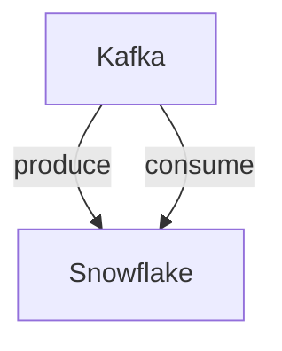

# Connect Kafka to Snowflake

Quix helps you integrate Kafka to Snowflake using pure Python.

## Snowflake

Snowflake is a cloud-based data warehousing platform that allows organizations to store and analyze large volumes of data. Its unique architecture separates storage and compute resources, allowing users to scale up or down based on their needs. Snowflake also features a number of built-in security features to ensure that data is kept safe and compliant with regulations. The platform is known for its performance and flexibility, making it a popular choice for companies looking to harness the power of big data for analytics and business intelligence. With Snowflake, organizations can easily query and visualize their data to gain valuable insights and drive better decision-making.

## Integrations

Quix Streams and Quix Cloud are good fits for integrating with Snowflake because they offer a comprehensive platform for developing, deploying, and managing real-time data pipelines. Snowflake is a cloud-based data warehousing platform that allows for the storage, transformation, and analysis of large volumes of data.

The key components of Quix Cloud, such as streamlined development and deployment, enhanced collaboration, real-time monitoring, and flexible scaling, align well with the capabilities of Snowflake. Quix Cloud's development tools, data exploration, visualization, and robust CI/CD processes can complement Snowflake's functionalities, making it easier to ingest, process, and analyze data in real-time.

Similarly, Quix Streams' cloud-native library for processing data in Kafka using Python can seamlessly integrate with Snowflake's data warehousing capabilities. The library's support for various serialization formats, time window aggregations, and resilient scaling fits well with Snowflake's data processing needs. Additionally, Quix Streams' Python ecosystem integration and support for local and Jupyter Notebook development provide flexibility and convenience in working with Snowflake data.

Overall, the features and capabilities of Quix Streams and Quix Cloud make them ideal solutions for integrating with Snowflake to create efficient and scalable data pipelines for real-time data processing and analysis.

