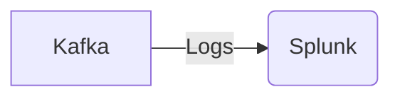

# Connect Kafka to Splunk

Quix helps you integrate Kafka to Splunk using pure Python.

## Splunk

Splunk is a powerful software platform designed to help organizations analyze and monitor their machine-generated data in real-time. It allows users to search, monitor, and analyze machine data from websites, applications, servers, networks, and mobile devices. Splunk can process and index massive amounts of data and turn it into valuable insights, helping users identify trends, troubleshoot issues, and make informed decisions. The platform offers a user-friendly interface and powerful search and visualization tools, making it a popular choice for IT operations, security, and business analytics teams. With Splunk, organizations can gain a deeper understanding of their data, improve operational efficiency, and enhance overall performance.

## Integrations

Quix is a good fit for integrating with Splunk because of its robust capabilities in developing, deploying, and managing real-time data pipelines. Splunk is a leading platform for analyzing and visualizing machine-generated data, making it a valuable tool for businesses looking to gain insights from their data in real-time.

Quix Streams, as a cloud-native library for processing data in Kafka using Python, seamlessly integrates with Python ecosystem libraries such as Pandas, scikit-learn, TensorFlow, and PyTorch. This integration allows for efficient data processing and analysis within the Splunk platform, enhancing the capabilities of data visualization and exploration.

Additionally, the streamlined development and deployment features of Quix Cloud, such as integrated online code editors, CI/CD tools, and YAML synchronization, align well with Splunk's requirements for efficient development and deployment of data pipelines. The real-time monitoring capabilities of Quix Cloud also complement Splunk's focus on real-time data analysis and monitoring, providing users with tools to monitor pipeline performance and critical metrics.

Furthermore, Quix Cloud's flexible scaling and management features, including the ability to easily scale resources, manage CPU and memory, and handle multiple environments linked to Git branches, align with Splunk's scalability requirements for handling large volumes of data. The security and compliance features of Quix Cloud also ensure secure management of data and compliance with regulations, making it a suitable choice for businesses that prioritize data security.

In conclusion, the comprehensive features of Quix make it a well-suited platform for integrating with Splunk, enabling businesses to efficiently process, analyze, and visualize their data in real-time.

