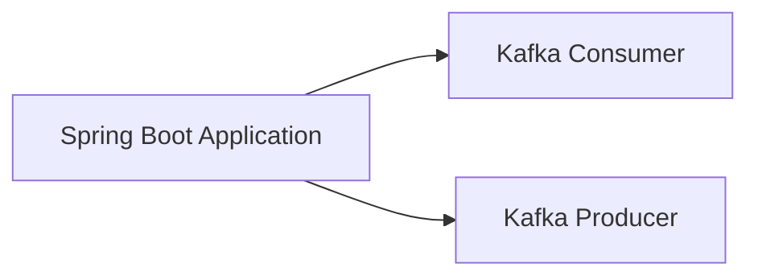

# Connect Kafka to Spring Boot

Quix helps you integrate Kafka to Spring Boot using pure Python.

## Spring Boot

Spring Boot is an open-source framework that simplifies the process of building, deploying, and running standalone, production-ready applications based on the Spring framework. It provides a streamlined experience for developers by offering pre-configured settings, automatic configuration, and a range of starter projects that quickly set up the necessary dependencies for a variety of development tasks. Spring Boot allows developers to easily create microservices, web applications, and RESTful APIs with minimal setup and configuration, making it a popular choice for modern software development projects. Its emphasis on convention over configuration and opinionated defaults make Spring Boot an efficient and user-friendly option for developing robust and scalable applications.

## Integrations

Spring Boot is a popular framework for building Java-based applications, known for its ease of use and rapid development capabilities. When integrating with Quix, Spring Boot can benefit from the platforms' real-time data processing capabilities and flexible scaling options.

Quix Cloud's streamlined development and deployment features, such as integrated online code editors and CI/CD tools, can enhance the development workflow when building Spring Boot applications. The platform's support for YAML synchronization for defining pipelines and environment variables as code can help streamline the deployment process for Spring Boot applications.

Enhanced collaboration features in Quix Cloud, such as organization and permission management, can improve team collaboration and project visibility when working on Spring Boot applications. Real-time monitoring tools provided by Quix Cloud can also be valuable for monitoring the performance of Spring Boot applications and critical metrics.

Flexible scaling and management options in Quix Cloud can help ensure that Spring Boot applications can efficiently scale resources, manage CPU and memory, and handle multiple environments linked to Git branches. The platform's security and compliance features, including secure management of secrets and compliance with dedicated infrastructure options, can also help ensure the security and stability of Spring Boot applications.

Overall, the features provided by Quix, such as streamlined development and deployment, enhanced collaboration, real-time monitoring, flexible scaling, and security and compliance measures, make them a good fit for integrating with Spring Boot applications to streamline development, enhance collaboration, and provide real-time data processing capabilities.

