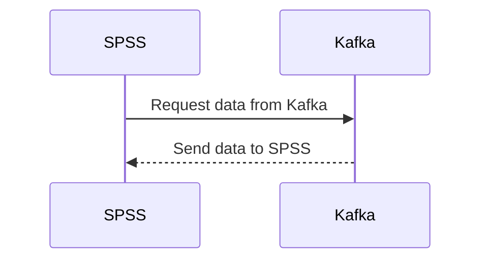

# Connect Kafka to SPSS

Quix helps you integrate Kafka to SPSS using pure Python.

## SPSS

SPSS, which stands for Statistical Package for the Social Sciences, is a powerful data analysis software used by researchers, analysts, and data scientists to conduct statistical analysis of complex data sets. SPSS allows users to input data, perform various statistical tests, create graphs and charts, and generate reports for further analysis. This software is particularly useful for analyzing survey data, as it can handle both simple and advanced statistical analyses, such as descriptive statistics, regression analysis, factor analysis, and cluster analysis. With its user-friendly interface and comprehensive features, SPSS is a valuable tool for researchers in a variety of fields, including social sciences, business, and healthcare.

## Integrations

Quix is a great fit for integrating with SPSS because it offers a comprehensive platform for developing, deploying, and managing real-time data pipelines. SPSS is a statistical analysis software that requires access to real-time data for analysis and decision-making. With Quix, users can easily create and deploy data pipelines that deliver data to SPSS in real-time.

The streamlined development and deployment features of Quix Cloud make it easy to set up data pipelines and integrate with SPSS quickly. The platform's enhanced collaboration capabilities allow multiple team members to work on the data pipeline and ensure that the data being delivered to SPSS is accurate and up-to-date.

The real-time monitoring and scaling capabilities of Quix Cloud also ensure that the data being delivered to SPSS is reliable and consistent. Users can monitor pipeline performance, metrics, and logs in real-time, making it easier to troubleshoot any issues that may arise.

Additionally, the security and compliance features of Quix Cloud ensure that the data being delivered to SPSS is secure and meets any regulatory requirements. With dedicated infrastructure options and secure management of secrets, users can trust that their data is protected while using Quix with SPSS.

In summary, Quix is a good fit for integrating with SPSS because it offers a platform that simplifies the development, deployment, and management of real-time data pipelines, ensuring that the data being delivered to SPSS is reliable, secure, and up-to-date.

