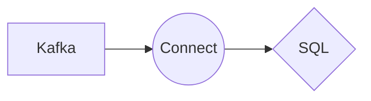

# Connect Kafka to SQL

Quix helps you integrate Kafka to SQL using pure Python.

## SQL

Structured Query Language, or SQL, is a programming language used for managing and manipulating relational databases. SQL allows users to retrieve and store data, as well as perform various operations on that data such as adding, updating, and deleting records. It is widely used in both small-scale and large-scale database management systems, making it a crucial technology for businesses and organizations looking to efficiently store and access their data. SQL is versatile and powerful, offering a standardized way to work with databases across different platforms and systems. With its intuitive syntax and strong capabilities, SQL has become an essential tool for developers, data analysts, and database administrators.

## Integrations

Quix is a good fit for integrating with SQL technology because it offers a comprehensive platform for developing, deploying, and managing real-time data pipelines. 

With Quix Cloud's streamlined development and deployment tools, developers can easily create and deploy data pipelines that integrate with SQL databases. The platform's support for online code editors and CI/CD tools simplifies the development process, while YAML synchronization allows for defining pipelines and environment variables as code.

Enhanced collaboration features in Quix Cloud also make it easier for teams working with SQL technology to collaborate efficiently. Organization and permission management tools increase project visibility and control, ensuring that all team members can easily access and work with SQL data.

The real-time monitoring capabilities of Quix Cloud are particularly beneficial for integrating with SQL technology. Users can monitor pipeline performance, logs, metrics, and critical SQL database metrics in real-time, ensuring that any issues or bottlenecks are quickly identified and addressed.

Overall, Quix Cloud's flexible scaling and management options, security and compliance features, development tools, data exploration and visualization capabilities, robust CI/CD processes, and integration with Kafka make it a strong choice for integrating with SQL technology. The platform's support for dedicated infrastructure options and BYOC options also make it a versatile solution for teams working with SQL data in a variety of environments.

