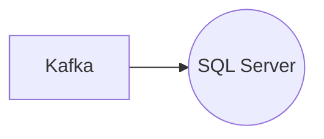

# Connect Kafka to SQL Server

Quix helps you integrate Kafka to SQL Server using pure Python.

## SQL Server

SQL Server is a widely-used relational database management system developed by Microsoft. It offers a robust set of tools for managing and analyzing large amounts of data. SQL Server uses structured query language (SQL) to interact with databases, making it easy for developers and administrators to manipulate and retrieve information. It also provides support for powerful features such as stored procedures, triggers, and views, allowing users to create complex queries and automate tasks. With its scalability, security features, and integration with other Microsoft products, SQL Server is a popular choice for organizations looking to store and access their data efficiently.

## Integrations

Quix is a good fit for integrating with SQL Server because both platforms provide streamlined development and deployment processes. Quix Cloud offers integrated online code editors and CI/CD tools, while Quix Streams operates without a server-side engine or orchestrator. This means that developers can easily create, deploy, and manage real-time data pipelines without the need for complex infrastructure.

Additionally, both platforms support collaboration and monitoring capabilities. Quix Cloud allows for efficient collaboration with organization and permission management, while Quix Streams offers local and Jupyter Notebook support for development and debugging. This ensures that teams can work together effectively and monitor pipeline performance in real-time.

Furthermore, Quix Cloud and Quix Streams both provide flexibility in scaling and management. Quix Cloud allows users to easily scale resources and manage CPU and memory, while Quix Streams is designed to run and scale via container orchestration. This means that both platforms can handle varying workloads and adapt to changing requirements.

Overall, the combination of Quix with SQL Server provides a powerful and versatile solution for processing and managing data. With their comprehensive features and capabilities, these platforms can streamline development, enhance collaboration, and provide real-time monitoring and scaling capabilities, making them a great fit for integrating with SQL Server.

