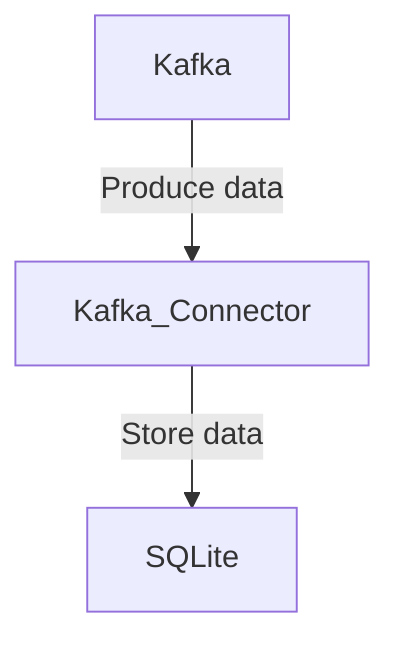

# Connect Kafka to SQLite

Quix helps you integrate Kafka to SQLite using pure Python.

## SQLite

SQLite is a lightweight, open-source, relational database management system that is self-contained and requires no server or configuration. It is compatible with all major operating systems and programming languages, making it a versatile solution for developers. SQLite is known for its simplicity and ease of use, as it allows users to store, retrieve, and manipulate data with SQL commands. Despite its small footprint, SQLite is powerful enough to handle complex database operations and is often used in mobile applications, embedded systems, and small-scale websites. Overall, SQLite is a reliable and efficient technology that provides a straightforward way to manage data without the need for a dedicated server.

## Integrations

Quix Streams and Quix Cloud are both well-suited for integrating with SQLite due to their capabilities in handling real-time data processing and management. SQLite is a lightweight, serverless, self-contained database engine that is widely used for embedded systems and small-scale applications. By integrating with Quix, users can take advantage of the following benefits:

1. Streamlined Development and Deployment: Both Quix Streams and Quix Cloud offer streamlined development and deployment processes through online code editors, CI/CD tools, and YAML synchronization. This makes it easier for developers to create, deploy, and manage data pipelines that interact with SQLite databases.

2. Enhanced Collaboration: The collaboration features in Quix Cloud such as organization and permission management can facilitate teamwork when working with SQLite databases. Multiple team members can collaborate on building data pipelines that incorporate SQLite as a data source or sink.

3. Real-Time Monitoring: Quix Cloud provides real-time monitoring tools for tracking pipeline performance and critical metrics. This can be valuable when integrating with SQLite databases to ensure that data is being processed and managed effectively in real-time.

4. Flexible Scaling and Management: Users can easily scale resources and manage CPU and memory usage when working with SQLite databases through Quix Cloud. This flexibility ensures that the integration can handle varying workloads and data processing requirements.

5. Security and Compliance: Quix Cloud offers secure management of secrets and compliance with infrastructure options and SLAs. This ensures that data stored and processed in SQLite databases remains secure and compliant with regulations.

6. Development Tools: Quix Cloud provides development tools and connectors for various data sources and sinks, making it easier to integrate SQLite databases into data pipelines. The online code editors and code templates can streamline the development process for working with SQLite data.

Overall, by integrating with Quix, developers can leverage their advanced features and capabilities to effectively manage and process data stored in SQLite databases in a real-time and scalable manner.

