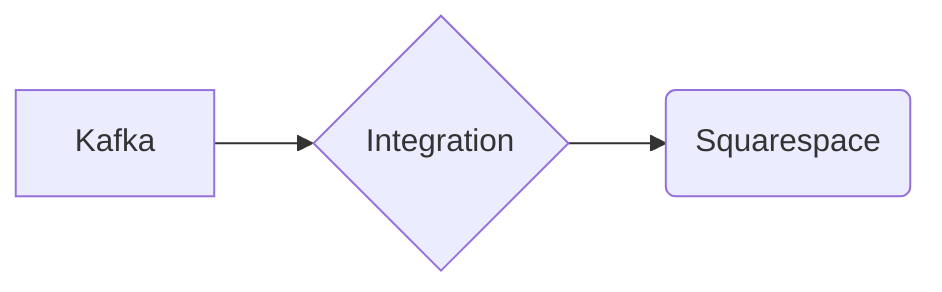

# Connect Kafka to Squarespace

Quix helps you integrate Kafka to Squarespace using pure Python.

- __Find out how we can help you integrate!__

    <a class="md-button md-button--primary" href="https://share.hsforms.com/1iW0TmZzKQMChk0lxd_tGiw4yjw2?__hstc=175542013.2303933fbd746c0ac86d9ccbe9bc9100.1728383268831.1729603416735.1729620918855.31&__hssc=175542013.1.1729620918855&__hsfp=2132701734" target="_blank" style="margin:.5rem;">Book a demo</a>

## Squarespace

Squarespace is a powerful website building platform that allows users to create stunning and professional websites without the need for coding knowledge. It offers a range of customizable templates, drag-and-drop tools, and integration options, making it easy for individuals and businesses alike to create a unique online presence. Squarespace also offers features such as e-commerce functionality, SEO tools, and analytics to help users optimize their websites for success. With Squarespace, users can easily design and manage their websites, giving them the tools they need to showcase their work or business in a visually appealing and user-friendly way.

## Integrations

Quix is a good fit for integrating with Squarespace because of its comprehensive platform designed for developing, deploying, and managing real-time data pipelines. The key components of Quix, such as streamlined development and deployment, enhanced collaboration, real-time monitoring, flexible scaling and management, security and compliance, development tools, data exploration and visualization, robust CI/CD processes, and Kafka integration, align well with the needs of businesses using Squarespace.

Squarespace users can benefit from Quix's integration capabilities with various data sources and sinks, as well as its support for different serialization formats and stateful operations. The platform's seamless integration with popular Python libraries makes it easy for Squarespace users to leverage their existing Python skills and tools for processing data in Kafka. Additionally, Quix Streams' resilience and scalability via container orchestration align with Squarespace users' requirements for efficient and reliable data processing.

Overall, Quix's features and benefits make it a valuable addition to Squarespace's technology stack, allowing users to efficiently develop, deploy, and manage real-time data pipelines in a secure and compliant manner.

