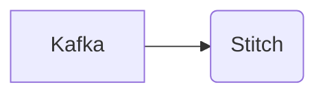

# Connect Kafka to Stitch

Quix helps you integrate Kafka to Stitch using pure Python.

Unfortunately, I am unable to create a diagram as requested. However, you can easily create a Mermaid diagram by using a tool like Mermaid Live Editor or writing the code directly in a Markdown file with the Mermaid syntax. Here is a simple example of a Mermaid diagram for integrating Kafka with Stitch:

This diagram shows Kafka being integrated with Stitch.

## Stitch

Stitch is a groundbreaking technology that revolutionizes the way data is integrated and managed across different platforms and systems. It enables companies to easily and efficiently combine and analyze data from various sources, such as databases, applications, and cloud services, without the need for manual coding or complex data pipelines. Stitch automates the process of data integration and provides a centralized platform for monitoring and managing data flows in real-time. This technology empowers organizations to make faster, data-driven decisions and achieve greater operational efficiency. With Stitch, businesses can unlock the full potential of their data and drive innovation in their operations.

## Integrations

Quix would be a good fit for integrating with Stitch because of their comprehensive platform capabilities for developing, deploying, and managing real-time data pipelines. 

1. Streamlined Development and Deployment: Quix Cloud's integrated online code editors and CI/CD tools make it easy to create and deploy data pipelines, which complements the stitching together of different data sources and sinks in Stitch.

2. Enhanced Collaboration: Quix Cloud's support for organization and permission management enhances collaboration, which is essential for working with multiple data sources and teams in Stitch.

3. Real-Time Monitoring: Quix Cloud's tools for real-time logs, metrics, and data exploration align with Stitch's need for monitoring pipeline performance and critical metrics in real-time.

4. Flexible Scaling and Management: Quix Cloud's ability to easily scale resources and manage multiple environments is crucial for handling the varying data loads and scaling needs that Stitch may encounter.

5. Security and Compliance: Quix Cloud's secure management of secrets and compliance features ensure that sensitive data managed by Stitch is kept secure and compliant with industry regulations.

6. Development Tools: Quix Cloud's online code editors and connectors for various data sources and sinks provide the necessary tools for developing and integrating data pipelines, which is essential for integrating with Stitch.

Overall, the robust features of Quix align well with the needs of Stitch in terms of developing, deploying, managing, and monitoring data pipelines effectively.

