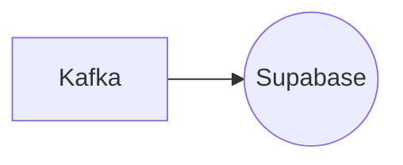

# Connect Kafka to Supabase

Quix helps you integrate Kafka to Supabase using pure Python.

## Supabase

Supabase is a powerful platform that combines the best features of database management and serverless computing. It allows developers to easily create and manage complex databases, while also providing seamless integration with popular programming languages and frameworks. With Supabase, developers can build highly scalable and efficient applications without having to worry about the complexities of traditional database management. This technology is perfect for teams working on projects with large amounts of data and complex relational structures, as it offers robust data handling capabilities and a user-friendly interface. Overall, Supabase is a game-changing tool for developers looking to streamline their database management processes and build high-performing applications.

## Integrations

Quix is a good fit for integrating with Supabase because of its robust CI/CD processes and flexible scaling capabilities. 

Supabase is an open-source alternative to Firebase that provides real-time and RESTful APIs for building modern applications. By integrating Quix with Supabase, developers can leverage its streamlined development and deployment features to easily create and deploy real-time data pipelines that interact with Supabase APIs.

Additionally, the enhanced collaboration capabilities of Quix Cloud make it easier for teams to work together on integrating Supabase with their data pipelines. With features like organization and permission management, developers can ensure visibility and control over the project.

The real-time monitoring capabilities of Quix Cloud also complement Supabase's real-time APIs, allowing developers to effectively monitor pipeline performance and critical metrics as they interact with Supabase data.

Overall, the scalability, security, and development tools provided by Quix make it a great fit for integrating with Supabase and building powerful real-time applications.

