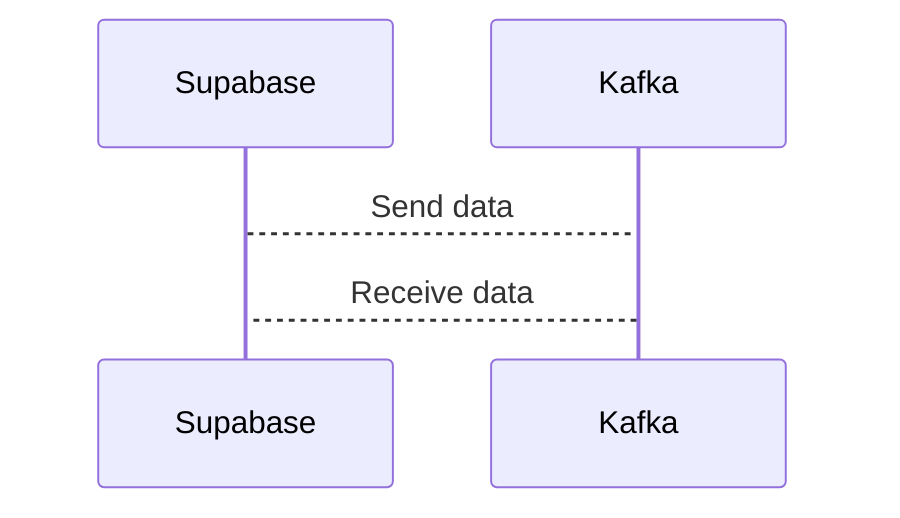

# Connect Kafka to Supabase

Quix helps you integrate Kafka to Supabase using pure Python.

<a class="md-button md-button--primary" href="https://share.hsforms.com/1iW0TmZzKQMChk0lxd_tGiw4yjw2?__hstc=175542013.2303933fbd746c0ac86d9ccbe9bc9100.1728383268831.1729603416735.1729620918855.31&__hssc=175542013.1.1729620918855&__hsfp=2132701734" target="_blank" style="margin-right:.5rem;">Book a demo</a>
 

## Supabase

Supabase is a next-generation database tool that combines the power of a traditional relational database with the flexibility and scalability of a cloud-native system. Through its use of PostgreSQL as the base technology, Supabase offers developers a familiar environment to work in while also providing advanced features like real-time updating, automated scaling, and seamless integration with popular frameworks like React and Vue.js. This allows developers to easily build and deploy applications without having to worry about the backend infrastructure, ultimately saving time and resources. With its focus on simplicity, speed, and security, Supabase is revolutionizing the way developers approach database management and application development.

## Integrations

Quix is a good fit for integrating with Supabase because both platforms offer complementary features that can enhance data processing and management capabilities. Quix Cloud's streamlined development and deployment tools can seamlessly integrate with Supabase's real-time database capabilities, providing a comprehensive solution for developing, deploying, and managing data pipelines. The enhanced collaboration features in Quix Cloud can also align with Supabase's focus on efficient collaboration and organization management, increasing project visibility and control.

Additionally, the real-time monitoring and scaling capabilities of Quix Cloud can work well with Supabase's focus on real-time data delivery and flexible scaling options. Quix's support for secure management of secrets and compliance with dedicated infrastructure options can also complement Supabase's security features, providing a robust and reliable integrated solution for data processing and management.

Furthermore, Quix Streams' cloud-native library for processing data in Kafka using Python can enhance the capabilities of Supabase by providing scalable and user-friendly data processing options. The integration of Quix Streams with Supabase can facilitate seamless data processing and analysis, supporting various serialization formats, time window aggregations, and resilient scaling options.

Overall, the integration of Quix with Supabase can provide users with a comprehensive and efficient solution for developing, deploying, and managing real-time data pipelines, enhancing collaboration, monitoring, scaling, and security capabilities. By leveraging the strengths of both platforms, organizations can streamline their data processing workflows and drive more impactful insights from their data.

