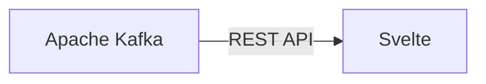

# Connect Kafka to Svelte

Quix helps you integrate Kafka to Svelte using pure Python.

## Svelte

Svelte is a modern JavaScript framework that allows developers to build web applications with a focus on performance and minimalism. Unlike other frameworks that rely on a virtual DOM for updating the interface, Svelte compiles components to highly optimized JavaScript code during build time, resulting in faster load times and a smaller bundle size. This approach eliminates the need for a runtime library, making Svelte ideal for building lightweight and efficient web applications. With its simple syntax and powerful features such as reactive statements and stores, Svelte provides developers with a smooth and enjoyable development experience. Overall, Svelte is a cutting-edge technology that empowers developers to create high-performance web applications with ease.

## Integrations

Svelte is a popular front-end technology known for its simplicity, efficiency, and ease of use when building web applications. Its key features include a reactive component model, easy-to-understand syntax, and automatic updates to the DOM.

Quix Streams and Quix Cloud are both geared towards enabling real-time data processing and streamlining development and deployment processes. Integrating either of these platforms with Svelte can offer several advantages:

1. Streamlined Development: Svelte's simple and intuitive syntax can help developers easily create components for visualizing and interacting with real-time data streams. Combined with Quix's development tools like online code editors and CI/CD capabilities, the integration can provide a seamless and efficient development experience.

2. Enhanced Collaboration: By using Quix for managing real-time data pipelines, teams can collaborate more effectively on building and deploying data-driven applications. With features like organization and permission management, developers can work together on developing Svelte components, integrating them with data pipelines, and monitoring their performance.

3. Real-Time Monitoring and Visualization: Svelte's reactive component model and Quix Cloud's real-time monitoring tools can be a powerful combination for building applications that visualize and analyze streaming data. Developers can easily create interactive dashboards, visualize data with tables and waveforms, and monitor critical metrics in real-time.

4. Flexible Scaling: Svelte's lightweight nature and Quix Cloud's scaling capabilities allow for easily scaling applications to handle increasing volumes of data. Developers can leverage container orchestration tools like Kubernetes to ensure efficient scaling and management of resources.

5. Seamless Integration With Kafka: Quix Streams' integration with Kafka and Quix Cloud's support for Kafka solutions can provide a robust foundation for building real-time data applications with Svelte. Developers can leverage Kafka's scalability and event-driven architecture in combination with Svelte's reactive components to create responsive and dynamic user interfaces.

Overall, integrating Svelte with Quix can empower developers to build sophisticated data-driven applications with real-time capabilities, efficient collaboration tools, and scalable architectures. This combination of technologies can streamline the development process, enhance team collaboration, and enable the creation of innovative and interactive data visualizations.

