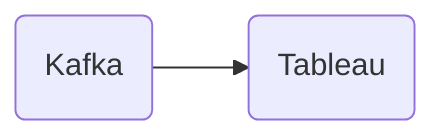

# Connect Kafka to Tableau

Quix helps you integrate Kafka to Tableau using pure Python.

## Tableau

Tableau is a powerful data visualization tool that allows users to create interactive and dynamic dashboards and reports. It helps users to easily connect to various data sources, including databases, spreadsheets, and cloud services, and visualize their data in a meaningful way. Tableau offers a wide range of visualization options, such as charts, graphs, maps, and tables, which can be customized and tailored to meet specific business needs. Its user-friendly interface and drag-and-drop functionalities make it accessible to users of all technical levels, enabling them to analyze and explore their data efficiently. Overall, Tableau is a valuable technology that helps organizations make informed decisions based on data-driven insights.

## Integrations

Quix is a good fit for integrating with Tableau because it offers a comprehensive platform for developing, deploying, and managing real-time data pipelines. 

Some of the key features of Quix Cloud, such as streamlined development and deployment, enhanced collaboration, real-time monitoring, flexible scaling and management, security and compliance, development tools, data exploration and visualization, robust CI/CD processes, Kafka integration, and dedicated/BYOC options, make it an ideal partner for integrating with Tableau.

By using Quix Streams, which is a cloud-native library for processing data in Kafka using Python, organizations can leverage the scalability of Kafka along with the user-friendly interface of Python. This integration allows for seamless data processing and visualization in Tableau, enabling users to make informed business decisions based on real-time data insights.

Overall, the combination of Quix with Tableau provides a powerful solution for organizations looking to streamline their data pipeline development and visualization processes.

