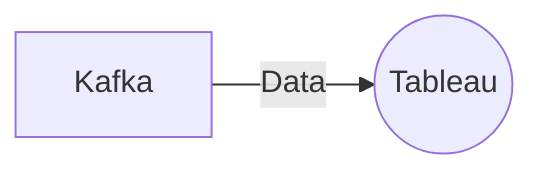

# Connect Kafka to Tableau

Quix helps you integrate Kafka to Tableau using pure Python.

<a class="md-button md-button--primary" href="https://share.hsforms.com/1iW0TmZzKQMChk0lxd_tGiw4yjw2?__hstc=175542013.2303933fbd746c0ac86d9ccbe9bc9100.1728383268831.1729603416735.1729620918855.31&__hssc=175542013.1.1729620918855&__hsfp=2132701734" target="_blank" style="margin-right:.5rem;">Book a demo</a>
 

## Tableau

Tableau is a powerful data visualization and analytics tool that allows users to easily create interactive and visually appealing dashboards and reports. It enables users to connect to various data sources, including spreadsheets, databases, and cloud services, to quickly analyze and visualize data in a meaningful way. Tableau provides a wide range of visualization options, such as charts, graphs, and maps, to help users gain insights and make informed decisions. Its intuitive drag-and-drop interface makes it easy for users of all skill levels to create and customize visualizations without the need for coding. Tableau is widely used across industries for data analysis, business intelligence, and reporting, helping organizations extract valuable insights from their data to drive business growth and success.

## Integrations

Quix is a good fit for integrating with Tableau because it offers a comprehensive platform for developing, deploying, and managing real-time data pipelines. Tableau is a powerful data visualization tool that allows users to create interactive and visually appealing dashboards and reports based on their data sources. By integrating Quix with Tableau, users can leverage the streamlined development and deployment features of Quix to easily access and process their data in real-time.

Quix's enhanced collaboration capabilities also make it a good fit for Tableau integration, as it supports efficient organization and permission management, increasing project visibility and control. This allows users to collaborate effectively on data pipelines and share their insights with Tableau visualizations.

Additionally, Quix's real-time monitoring and scaling capabilities align well with Tableau's focus on real-time data visualization. Users can monitor pipeline performance and critical metrics in real-time, providing valuable insights for creating dynamic and responsive Tableau dashboards.

Overall, Quix's flexibility, security, and development tools make it a strong partner for integrating with Tableau, enabling users to seamlessly access, process, and visualize their data in a collaborative and efficient manner.

