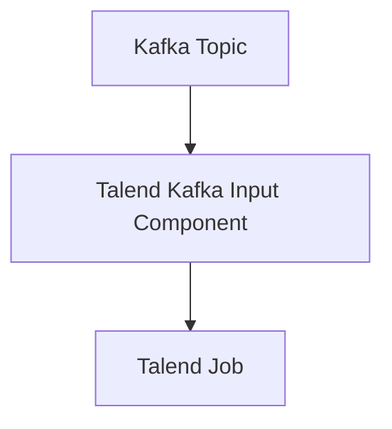

# Connect Kafka to Talend

Quix helps you integrate Kafka to Talend using pure Python.

## Talend

Talend is a powerful and versatile data integration software that allows businesses to efficiently manage and analyze their data. With Talend, users can easily extract, transform, and load data from various sources, such as databases, files, and cloud applications, in order to create meaningful insights and drive informed decision-making. This technology offers a user-friendly interface that simplifies the process of designing data workflows and ensures seamless data integration across different systems. Talend also provides advanced features, such as data quality checks, real-time data processing, and automated data pipelines, to help organizations streamline their data management tasks and enhance productivity. Overall, Talend is a reliable and innovative solution that enables businesses to harness the full potential of their data for improved performance and competitiveness.

## Integrations

Quix is a good fit for integrating with Talend because both platforms offer streamlined development, enhanced collaboration, real-time monitoring, and flexible scaling capabilities. 

1. Streamlined Development and Deployment: Both Quix Streams and Quix Cloud provide tools and features to simplify the creation and deployment of data pipelines. This aligns with Talend's goal of making data integration and management more efficient and user-friendly.

2. Enhanced Collaboration: Quix Cloud supports efficient collaboration through organization and permission management, increasing project visibility and control. This complements Talend's focus on teamwork and collaboration in data integration projects.

3. Real-Time Monitoring: Both platforms offer tools for real-time monitoring of pipeline performance and critical metrics. This aligns with Talend's emphasis on real-time data processing and monitoring to ensure data accuracy and efficiency.

4. Flexible Scaling and Management: Users can easily scale resources, manage CPU and memory, and handle multiple environments linked to Git branches in both Quix Streams and Quix Cloud. This flexibility aligns with Talend's goal of providing scalable and manageable data integration solutions.

5. Security and Compliance: Both platforms ensure secure management of secrets and compliance with dedicated infrastructure options and SLAs. This aligns with Talend's focus on data security and compliance in data integration processes.

6. Development Tools: Quix Cloud includes online code editors, code templates, and connectors for various data sources and sinks, supporting DevContainers for enhanced workflows. This complements Talend's comprehensive suite of development tools for data integration and management.

In summary, integrating Quix with Talend would provide a robust and comprehensive solution for developing, deploying, and managing real-time data pipelines with enhanced collaboration, monitoring, and scalability capabilities.

