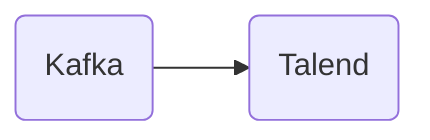

# Connect Kafka to Talend

Quix helps you integrate Kafka to Talend using pure Python.

<a class="md-button md-button--primary" href="https://share.hsforms.com/1iW0TmZzKQMChk0lxd_tGiw4yjw2?__hstc=175542013.2303933fbd746c0ac86d9ccbe9bc9100.1728383268831.1729603416735.1729620918855.31&__hssc=175542013.1.1729620918855&__hsfp=2132701734" target="_blank" style="margin-right:.5rem;">Book a demo</a>
 

## Talend

Talend is a powerful and versatile data integration software that enables organizations to efficiently manage and transform their data. It is equipped with a wide range of features that allow users to extract, cleanse, load, and manipulate data from various sources such as databases, applications, and cloud platforms. With its user-friendly interface and drag-and-drop tools, Talend makes data integration accessible to users of all skill levels. Additionally, Talend offers advanced capabilities for data quality management, master data management, and big data integration, making it a comprehensive solution for businesses looking to streamline their data integration processes. Overall, Talend is a robust technology that enables organizations to harness the power of their data and gain valuable insights for decision-making.

## Integrations

Quix is a good fit for integrating with Talend because both platforms offer streamlined development and deployment features. Quix Cloud provides tools for defining pipelines and environment variables as code, while Talend offers integrated code editors and CI/CD tools for simplifying the creation and deployment of data pipelines.

Additionally, Quix Cloud and Talend both support collaboration and organization management, enhancing project visibility and control. Quix Cloud's efficient collaboration features complement Talend's organization and permission management capabilities, making it easier for teams to work together on data projects.

Moreover, Quix Cloud's real-time monitoring and scaling capabilities align well with Talend's focus on scalability and management. Both platforms allow users to monitor pipeline performance, scale resources, and manage CPU and memory efficiently.

Furthermore, Quix's integration with Kafka, including support for third-party solutions like Confluent Cloud and Redpanda, complements Talend's robust CI/CD processes. This integration enables seamless data processing and streaming in Kafka using Python, enhancing the overall functionality and flexibility of the integrated platform.

