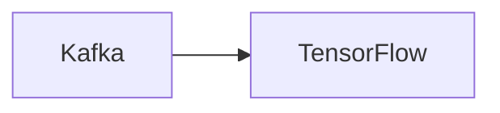

# Connect Kafka to TensorFlow

Quix helps you integrate Kafka to TensorFlow using pure Python.

Here is the mermaid diagram:

## TensorFlow

TensorFlow is an open-source machine learning framework developed by Google that is widely used for building and training deep learning models. It is designed to make it easy for developers to create and deploy machine learning models across a variety of platforms. TensorFlow uses data flow graphs to represent complex mathematical computations as a series of nodes that operate on multidimensional arrays called tensors. This allows for efficient parallel processing and optimization of computations, making it ideal for training and deploying deep neural networks. TensorFlow supports a wide range of programming languages and is known for its scalability, flexibility, and performance, making it a popular choice for researchers and developers working on a wide range of machine learning applications.

## Integrations

Quix is a good fit for integrating with the technology called TensorFlow because of its robust support for data processing and real-time monitoring capabilities. TensorFlow is a popular open-source machine learning library that is commonly used for building and training deep learning models. By integrating with Quix, users can leverage its streamlined development and deployment features, enhanced collaboration tools, real-time monitoring capabilities, and flexible scaling and management options to build, deploy, and manage TensorFlow models effectively.

More specifically, Quix Streams provides a cloud-native library for processing data in Kafka using Python, which aligns well with TensorFlow's Python ecosystem integration. The library supports serialization and state management, time window aggregations, and resilient scaling, all of which are essential for working with TensorFlow models. Additionally, the platform's support for local and Jupyter Notebook development enables users to easily experiment with TensorFlow code and algorithms before deploying them to production.

Overall, integrating Quix with TensorFlow can streamline the development and deployment of machine learning models, enhance collaboration among data scientists and engineers, provide real-time monitoring and scaling capabilities, and ensure secure management of data and compliance with industry regulations.

