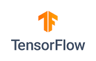

# Connect Kafka to TensorFlow

Quix helps you integrate Kafka to TensorFlow using pure Python.

<a class="md-button md-button--primary" href="https://share.hsforms.com/1iW0TmZzKQMChk0lxd_tGiw4yjw2?__hstc=175542013.2303933fbd746c0ac86d9ccbe9bc9100.1728383268831.1729603416735.1729620918855.31&__hssc=175542013.1.1729620918855&__hsfp=2132701734" target="_blank" style="margin-right:.5rem;">Book a demo</a>
 

graph TD
    A(Kafka) --> B(TensorFlow)

## TensorFlow

TensorFlow is an open-source machine learning framework developed by Google for building and training deep learning models. It is designed to be flexible and customizable, allowing developers to create a wide range of neural network architectures for tasks such as image recognition, natural language processing, and reinforcement learning. TensorFlow uses symbolic math libraries and data flow graphs to efficiently train models on large datasets across multiple devices. With its extensive library of pre-built modules and tools, TensorFlow enables researchers and developers to experiment with cutting-edge AI algorithms and create scalable, production-ready applications.

## Integrations

Quix is a good fit for integrating with TensorFlow because it provides a comprehensive platform for developing, deploying, and managing real-time data pipelines. TensorFlow is a popular open-source machine learning library developed by Google that is widely used for deep learning applications. With Quix's streamlined development and deployment features, integrated online code editors, and CI/CD tools, developers can easily create and deploy data pipelines that incorporate TensorFlow models.

Additionally, Quix's support for enhanced collaboration and organization and permission management capabilities make it easy for teams to work together on TensorFlow projects. Real-time monitoring tools provided by Quix Cloud allow users to monitor pipeline performance and critical metrics when working with TensorFlow models, ensuring optimal performance.

Quix Streams, a cloud-native library for processing data in Kafka using Python, also complements TensorFlow integration well. With support for serialization formats, stateful operations, time window aggregations, and resilient scaling, Quix Streams can help support the processing and preparation of data for TensorFlow models.

Overall, the combination of Quix's features for streamlined development, collaboration, monitoring, and scaling, along with its support for Python libraries like TensorFlow, make it a suitable platform for integrating with TensorFlow for machine learning and deep learning applications.

