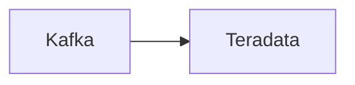

# Connect Kafka to Teradata

Quix helps you integrate Kafka to Teradata using pure Python.

## Teradata

Teradata is a leading data analytics and data warehousing technology that helps organizations manage and analyze massive amounts of data to make informed business decisions. It offers a scalable and high-performance platform that can handle large volumes of data from multiple sources, enabling businesses to extract valuable insights and trends. With its advanced analytics capabilities, Teradata allows users to perform complex queries and predictive analytics to drive innovation and improve operational efficiency. Its robust security features and compliance controls make it a trusted solution for businesses in various industries looking to harness the power of their data for strategic business growth.

## Integrations

Quix is a good fit for integrating with Teradata because both platforms offer streamlined development and deployment processes that align well with Teradata's data processing capabilities. The ability to define pipelines and environment variables as code using YAML synchronization in Quix Cloud can facilitate seamless integration with Teradata's data pipelines.

Additionally, the enhanced collaboration features in Quix Cloud, such as organization and permission management, can help improve project visibility and control when working with Teradata's data. The real-time monitoring and scaling capabilities in Quix Cloud also align with the requirements of Teradata, allowing users to efficiently monitor pipeline performance and easily scale resources as needed.

Furthermore, the security and compliance features in Quix Cloud ensure secure management of secrets and compliance with regulations, which is essential when working with sensitive data in Teradata. The integration with Git providers like GitHub and Bitbucket for CI/CD processes also enhances the development workflow when integrating with Teradata.

In the case of Quix Streams, its cloud-native library for processing data in Kafka using Python can seamlessly interface with Teradata's data processing capabilities. The Python ecosystem integration in Quix Streams allows for easy collaboration with libraries commonly used in data analytics and machine learning, enhancing the overall data processing workflow with Teradata.

Overall, the features and capabilities offered by Quix Streams and Quix Cloud make them a good fit for integrating with Teradata, facilitating efficient and streamlined data processing and management tasks.

