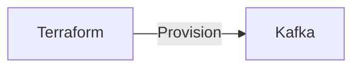

# Connect Kafka to Terraform

Quix helps you integrate Kafka to Terraform using pure Python.

## Terraform

Terraform is an open-source infrastructure as code software tool created by HashiCorp. It allows users to define and provision infrastructure in a declarative configuration language, making it easier to manage and scale resources across cloud providers. Terraform enables users to automate the deployment and management of servers, databases, networks, and other infrastructure components through code, reducing the complexity and manual effort of managing infrastructure. With Terraform, users can create and modify infrastructure resources in a safe and predictable manner, ensuring consistency and reproducibility in their environments. Overall, Terraform empowers organizations to streamline their infrastructure management processes and accelerate their deployment workflows.

## Integrations

Quix Streams and Quix Cloud are both well-suited for integrating with Terraform due to their comprehensive features and compatibility with modern DevOps practices.

1. Streamlined Development and Deployment: Both Quix Cloud and Quix Streams offer streamlined development and deployment capabilities, which aligns with Terraform's infrastructure as code approach. By defining data pipelines and environment variables as code using YAML synchronization, users can easily manage and deploy their infrastructure changes with Terraform.

2. Real-Time Monitoring and Scaling: Quix Cloud provides real-time monitoring and scaling capabilities, which are crucial for managing and optimizing the performance of data pipelines. By integrating with Terraform, users can automate the scaling of resources and infrastructure based on monitoring metrics, ensuring optimal performance and resource utilization.

3. Enhanced Collaboration and Security: Quix Cloud's support for organization and permission management enhances collaboration among team members, while also ensuring secure management of secrets. By integrating with Terraform, users can leverage Terraform's infrastructure management features to define and enforce security policies, manage access controls, and ensure compliance with regulations.

4. CI/CD Processes and Kafka Integration: Quix Cloud's robust CI/CD processes and support for Kafka integration make it a natural fit for integrating with Terraform. Users can automate the deployment of data pipelines, leverage Kafka for stream processing, and seamlessly manage their infrastructure using Terraform's version control integration and infrastructure automation capabilities.

Overall, the combination of Quix with Terraform provides a powerful set of tools for developing, deploying, and managing real-time data pipelines in a scalable, efficient, and collaborative manner. By leveraging the strengths of both platforms, users can streamline their workflow, enhance scalability and monitoring capabilities, and ensure the security and compliance of their data pipelines.

