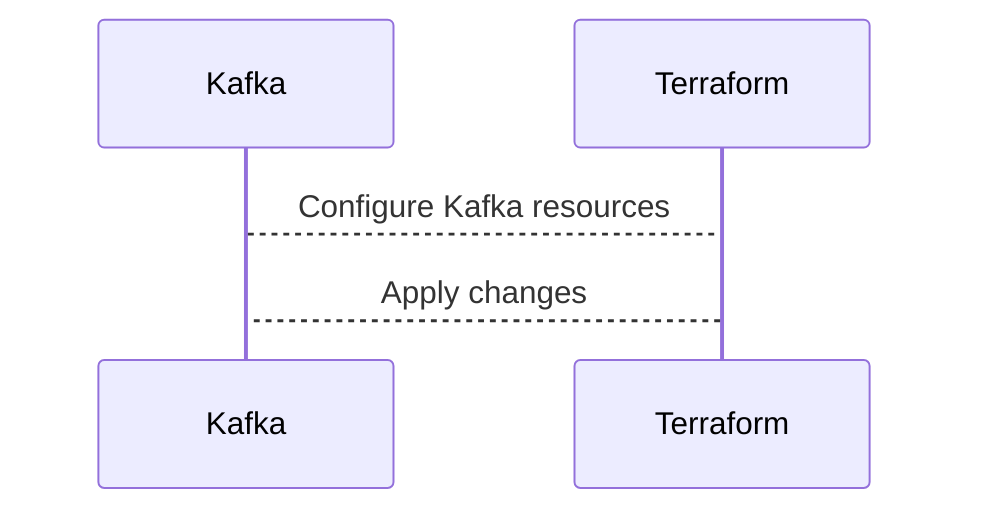

# Connect Kafka to Terraform

Quix helps you integrate Kafka to Terraform using pure Python.

<a class="md-button md-button--primary" href="https://share.hsforms.com/1iW0TmZzKQMChk0lxd_tGiw4yjw2?__hstc=175542013.2303933fbd746c0ac86d9ccbe9bc9100.1728383268831.1729603416735.1729620918855.31&__hssc=175542013.1.1729620918855&__hsfp=2132701734" target="_blank" style="margin-right:.5rem;">Book a demo</a>
 

## Terraform

Terraform is an open-source tool that allows users to build, manage, and version infrastructure as code. It provides a declarative configuration language to describe the desired state of the infrastructure, and then automatically handles the provisioning and management of resources necessary to achieve that state. Terraform supports a wide range of cloud providers, including AWS, Azure, Google Cloud, and many others, making it a popular choice for organizations with multi-cloud environments. With Terraform, users can easily create and manage complex infrastructure setups, ensure consistency across environments, and easily scale resources as needed, making it a powerful and versatile tool for modern DevOps and cloud deployment workflows.

## Integrations

Quix is a good fit for integrating with Terraform due to its comprehensive platform capabilities that align well with Terraform's infrastructure as code approach. Here are some reasons why Quix and Terraform can work together effectively:

1. Streamlined Development and Deployment: Quix's support for defining pipelines and environment variables as code using YAML synchronization aligns well with Terraform's infrastructure as code methodology. This allows users to manage their data pipelines and infrastructure in a streamlined and efficient manner.

2. Flexible Scaling and Management: Quix's ability to easily scale resources and manage CPU and memory, along with its support for multiple environments linked to Git branches, synergizes with Terraform's ability to provision and manage infrastructure resources in a flexible and scalable way.

3. Security and Compliance: Quix's focus on secure management of secrets and compliance with dedicated infrastructure options complements Terraform's emphasis on secure and compliant infrastructure provisioning. By integrating Quix with Terraform, users can ensure that their data pipelines are deployed on secure and compliant infrastructure.

4. Development Tools: Quix's online code editors, code templates, and connectors for various data sources and sinks, coupled with Terraform's support for defining infrastructure as code, provide users with powerful tools for developing and deploying data pipelines in a collaborative and efficient manner.

5. Kafka Integration: Quix's support for both Quix-hosted and third-party Kafka solutions, as well as its integration with Terraform for provisioning Kafka resources, allows users to seamlessly manage their Kafka infrastructure alongside their data pipelines.

By integrating Quix with Terraform, users can leverage the strengths of both platforms to develop, deploy, and manage real-time data pipelines in a streamlined, efficient, and scalable manner.

