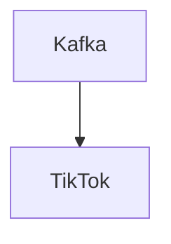

# Connect Kafka to TikTok

Quix helps you integrate Kafka to TikTok using pure Python.

## TikTok

TikTok is a social media platform that allows users to create and share short video clips, typically set to music or sound bites. It has quickly gained popularity among a younger demographic for its easy-to-use interface and the ability to showcase creativity and humor in a concise format. Users can add filters and effects to their videos, as well as participate in challenges and trends that circulate throughout the platform. With a vast library of songs and sounds to choose from, TikTok offers a unique and engaging way for users to express themselves and connect with others around the world.

## Integrations

Quix is a good fit for integrating with TikTok because it offers a comprehensive platform for developing, deploying, and managing real-time data pipelines. TikTok generates vast amounts of data in real-time, including user interactions, videos, and trends. Quix Cloud's features such as streamlined development and deployment, real-time monitoring, flexible scaling, and robust CI/CD processes make it well-equipped to handle and process the high volume of data generated by TikTok.

Additionally, Quix Streams, with its cloud-native library for processing data in Kafka using Python, offers easy integration with Python ecosystem libraries commonly used for data analysis and machine learning tasks. This integration enables TikTok to perform advanced analytics and extract valuable insights from the data being generated on the platform.

The scalability of Quix Streams through container orchestration, support for time window aggregations, and resilience in scaling make it a suitable choice for handling the dynamic and high-load nature of TikTok's data streams. The platform's security and compliance features also ensure that sensitive data is managed securely in accordance with regulations.

Overall, Quix's capabilities align well with the requirements of integrating with TikTok, making it a good fit for processing and analyzing the platform's real-time data effectively.

