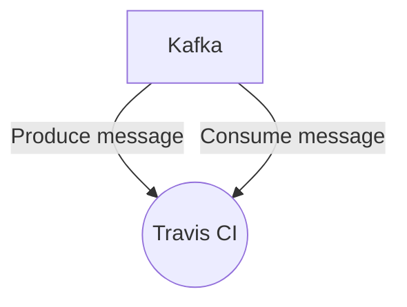

# Connect Kafka to Travis CI

Quix helps you integrate Kafka to Travis CI using pure Python.

## Travis CI

Travis CI is a continuous integration technology that allows developers to automate the process of testing and deploying their code changes. By connecting Travis CI to their code repository, developers can set up automated build and test scripts that run every time a new code change is submitted. This helps to catch bugs and errors early in the development process, ensuring that the code is clean and functional before it is deployed to production. Travis CI supports a wide range of programming languages and platforms, making it a versatile tool for teams working on different types of projects. With its simple setup and integration with popular code hosting platforms like GitHub, Travis CI has become a popular choice for developers looking to streamline their development workflow.

## Integrations

Quix is a good fit for integrating with Travis CI because both platforms offer streamlined development and deployment capabilities. Travis CI is a continuous integration tool that automates the testing and deployment of code changes, ensuring that software builds are always stable and up-to-date. By integrating with Quix, developers can easily define data pipelines and environment variables as code, streamlining the process of deploying real-time data pipelines. Additionally, Quix Cloud provides tools for real-time monitoring and scaling, allowing users to easily monitor pipeline performance and scale resources as needed. With enhanced collaboration features and support for CI/CD processes, integrating Travis CI with Quix can help ensure a seamless and efficient development workflow for real-time data processing projects.

