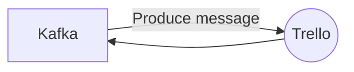

# Connect Kafka to Trello

Quix helps you integrate Kafka to Trello using pure Python.

## Trello

Trello is a popular project management tool that utilizes a digital board and card system to help users organize and prioritize tasks, projects, and workflows. With Trello, teams can create boards for different projects and then add cards to represent individual tasks or items that need to be completed. Users can easily move cards around on the board, assign tasks to specific team members, set due dates, add attachments or comments, and more. Trello's visual and intuitive interface makes it easy for teams to collaborate, communicate, and stay on top of their work in a flexible and customizable way. This technology is especially useful for remote teams or individuals looking to stay organized and productive.

## Integrations

Quix is a good fit for integrating with Trello because of its comprehensive features that streamline development, enhance collaboration, and provide real-time monitoring and scaling capabilities. 

1. Streamlined Development and Deployment: With integrated online code editors and CI/CD tools, developers can easily create and deploy data pipelines, making it convenient to integrate with Trello for managing tasks and projects efficiently. YAML synchronization allows for defining pipelines and environment variables as code, ensuring consistency across different platforms.

2. Enhanced Collaboration: Quix Cloud's organization and permission management features promote efficient collaboration, which is essential for teams using Trello to work together on tasks and projects. Increased project visibility and control can enhance productivity and communication among team members.

3. Real-Time Monitoring: Quix Cloud provides tools for real-time logs, metrics, and data exploration, allowing users to monitor pipeline performance and critical metrics. This real-time monitoring capability can be beneficial for keeping track of progress and identifying issues promptly when integrated with Trello for project management.

4. Flexible Scaling and Management: The ability to easily scale resources and manage CPU and memory can be advantageous when integrating with Trello, especially for handling multiple environments and scaling as needed based on project requirements. Seamless integration with Git branches also offers a convenient way to manage code changes and updates.

Overall, the features of Quix align with the needs of organizations using Trello for project management, offering a robust platform for developing, deploying, and managing data pipelines efficiently.

