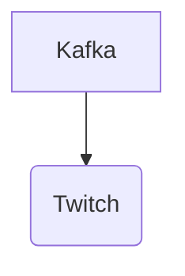

# Connect Kafka to Twitch

Quix helps you integrate Kafka to Twitch using pure Python.

## Twitch

Twitch is a popular live streaming platform that allows users to broadcast their gameplay, music performances, podcasts, and other creative content to a global audience. Viewers can interact with the streamer through a chat feature, cheering with virtual currency called Bits, and subscribing to their channel for exclusive perks. Twitch has become a hub for gaming enthusiasts, esports competitions, and internet personalities, with millions of users tuning in daily to watch their favorite streamers. The platform has also expanded to include a variety of categories beyond gaming, making it a versatile and engaging platform for content creators and viewers alike.

## Integrations

Quix is a good fit for integrating with Twitch because of its ability to process real-time data and handle large volumes of data efficiently. Twitch is a live streaming platform that generates a massive amount of data such as user interactions, chat messages, and video streams. By integrating Quix with Twitch, developers can easily create data pipelines to process and analyze this data in real-time.

The features of Quix Streams and Quix Cloud such as streamlined development and deployment, real-time monitoring, flexible scaling, and data exploration and visualization make it well-suited for handling the dynamic and fast-paced nature of Twitch data. The platform's integration with Kafka also allows for seamless data streaming and processing, which is essential for managing the constant influx of data from Twitch streams.

Additionally, Quix Streams' support for Python ecosystem integration and serialization formats align well with the programming language preferences of many developers working with Twitch data. Its resilience scaling capabilities and support for container orchestration make it a reliable and scalable solution for handling the high demands of Twitch data processing.

Overall, the comprehensive features and capabilities of Quix make it an ideal choice for integrating with Twitch and effectively managing the real-time data pipelines required for analyzing and deriving insights from Twitch data.

