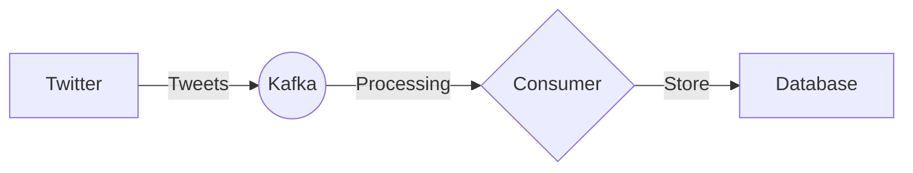

# Connect Kafka to Twitter

Quix helps you integrate Kafka to Twitter using pure Python.

## Twitter

Twitter is a social media platform that allows users to post short messages, known as tweets, to their followers. These tweets can be up to 280 characters long and can include text, images, videos, and links. Users can also like, share, and comment on tweets to engage with other users. With over 330 million active users worldwide, Twitter has become a popular platform for sharing news, information, opinions, and updates in real-time. Additionally, Twitter is known for its trending topics and hashtags, which help users discover new content and join conversations on a wide range of topics.

## Integrations

Quix is a good fit for integrating with Twitter due to its real-time data processing capabilities, seamless integration with Kafka, and Python ecosystem integration. Twitter generates a massive amount of real-time data that needs to be processed quickly and efficiently. Quix Streams, with its cloud-native library designed for processing data in Kafka using Python, can effectively handle the high volume of data streams from Twitter.

The platform's real-time monitoring and scaling capabilities would be essential for managing the constant influx of data from Twitter. Additionally, its flexible scaling and management features would allow for easy adjustments to accommodate fluctuations in data volume.

Quix Streams also supports serialization and state management, which are crucial for handling the diverse data formats and structures found in Twitter data. Its time window aggregations feature would be beneficial for analyzing trends and patterns in Twitter data over specific time intervals.

Overall, the streamlined development and deployment process, enhanced collaboration tools, and robust CI/CD processes of Quix Cloud make it a suitable choice for integrating with Twitter and efficiently processing and analyzing the vast amounts of real-time data generated by the platform.

