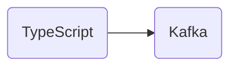

# Connect Kafka to TypeScript

Quix helps you integrate Kafka to TypeScript using pure Python.

## TypeScript

TypeScript is a statically-typed superset of JavaScript that compiles to plain JavaScript. It was developed by Microsoft and offers developers the ability to add static types to their code, providing the benefits of type checking, better code organization, and improved error detection. TypeScript also includes the latest features from ECMAScript, such as async/await and decorators, making it a powerful tool for building modern web applications. With its strong typing system and compatibility with existing JavaScript code, TypeScript has gained popularity among developers looking to write more robust and maintainable code.

## Integrations

TypeScript is a statically typed superset of JavaScript that adds optional static type checking to the language. It offers benefits such as improved code quality, enhanced developer productivity, and better error detection. Integrating Quix with TypeScript can provide several advantages:

1. Type Safety: TypeScript's static typing helps catch errors during development, preventing runtime issues and improving code reliability. By using TypeScript with Quix, developers can ensure that data handling and processing within real-time data pipelines are type-safe, reducing the risk of runtime errors.

2. Code Maintainability: TypeScript's type system allows for more robust and maintainable codebases by providing clearer documentation of data structures and function signatures. Integrating TypeScript with Quix enables developers to easily understand and manage the codebase, facilitating collaboration and reducing technical debt.

3. Tooling and IDE Support: TypeScript offers rich tooling and IDE support, such as code completion, refactoring capabilities, and error highlighting. By using TypeScript with Quix, developers can take advantage of these features to improve their development workflows, increase productivity, and ensure code consistency.

4. Compatibility with JavaScript Ecosystem: TypeScript is designed to be a superset of JavaScript, allowing existing JavaScript codebases to be gradually migrated to TypeScript. This compatibility with the JavaScript ecosystem makes it easier for developers to integrate Quix with TypeScript, leveraging existing tools, libraries, and frameworks to enhance their real-time data pipelines.

Overall, integrating Quix with TypeScript can improve code quality, enhance developer productivity, and facilitate collaboration within real-time data pipeline projects. By leveraging TypeScript's static typing, tooling support, and compatibility with the JavaScript ecosystem, developers can build robust, maintainable, and efficient data processing solutions.

