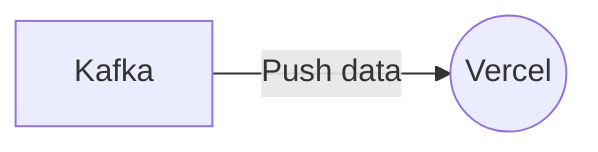

# Connect Kafka to Vercel

Quix helps you integrate Kafka to Vercel using pure Python.

<a class="md-button md-button--primary" href="https://share.hsforms.com/1iW0TmZzKQMChk0lxd_tGiw4yjw2?__hstc=175542013.2303933fbd746c0ac86d9ccbe9bc9100.1728383268831.1729603416735.1729620918855.31&__hssc=175542013.1.1729620918855&__hsfp=2132701734" target="_blank" style="margin-right:.5rem;">Book a demo</a>
 

## Vercel

Vercel is a cloud platform specializing in deploying and hosting static websites and serverless functions. It provides developers with a seamless workflow for building, previewing, and deploying their projects with ease. Vercel offers features such as automatic SSL certificates, continuous integration and deployment (CI/CD), and real-time collaboration with colleagues. It supports various frameworks and languages, making it a versatile choice for web development projects. With instant deployment and scaling capabilities, Vercel helps developers streamline their workflow and focus on building high-quality, performant websites and applications.

## Integrations

Quix is a good fit for integrating with Vercel because it provides a comprehensive platform for developing, deploying, and managing real-time data pipelines. Vercel is a cloud platform that specializes in hosting frontend applications and serverless functions, making it a perfect complement to Quix's backend data processing capabilities.

One key component of Quix that aligns well with Vercel is its streamlined development and deployment features. With integrated online code editors and CI/CD tools, developers can easily create and deploy data pipelines on Quix. This aligns with Vercel's focus on simplifying the deployment process for developers, making it easy to integrate the two technologies seamlessly.

Additionally, Quix's real-time monitoring capabilities are well-suited for Vercel's emphasis on performance and scalability. Quix Cloud provides tools for monitoring pipeline performance and critical metrics in real-time, allowing developers to ensure that their applications are running smoothly on Vercel's platform.

Furthermore, Quix's support for Kafka integration and dedicated infrastructure options make it a flexible solution for a variety of use cases, including those that require high scalability and compliance with specific security requirements. This aligns well with Vercel's flexible scaling and management capabilities, allowing users to easily scale resources and manage multiple environments.

Overall, the combination of Quix's robust backend data processing capabilities and Vercel's frontend hosting and serverless functions make them a great fit for integrating and building powerful, scalable applications.

