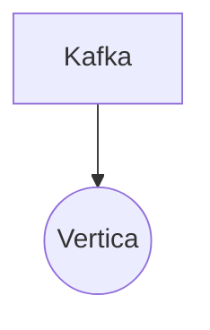

# Connect Kafka to Vertica

Quix helps you integrate Kafka to Vertica using pure Python.

- __Find out how we can help you integrate!__

    <a class="md-button md-button--primary" href="https://share.hsforms.com/1iW0TmZzKQMChk0lxd_tGiw4yjw2?__hstc=175542013.2303933fbd746c0ac86d9ccbe9bc9100.1728383268831.1729603416735.1729620918855.31&__hssc=175542013.1.1729620918855&__hsfp=2132701734" target="_blank" style="margin:.5rem;">Book a demo</a>

## Vertica

Vertica is a high-performance, petabyte-scale analytics database designed to handle large volumes of data quickly and efficiently. It utilizes a columnar storage format and query optimization techniques to deliver fast query performance for analytic workloads. Vertica is also known for its scalability, allowing businesses to easily add more storage capacity and processing power as their data grows. With advanced features like machine learning and geospatial analysis, Vertica enables organizations to derive valuable insights from their data and make data-driven decisions. Overall, Vertica provides a powerful solution for businesses looking to analyze and leverage their data in real-time.

## Integrations

Quix is a good fit for integrating with Vertica because it provides a comprehensive platform for developing, deploying, and managing real-time data pipelines. Vertica is a powerful and scalable analytical database that can handle large volumes of data. 

With Quix's streamlined development and deployment features, developers can easily create and deploy data pipelines that integrate with Vertica. The platform's online code editors and CI/CD tools simplify the process of building and deploying pipelines, while YAML synchronization allows for defining pipelines and environment variables as code.

Quix also offers enhanced collaboration capabilities, enabling efficient project management and increased visibility and control. This is crucial for teams working with Vertica, as it allows for seamless collaboration and coordination on data pipeline development.

Additionally, Quix's real-time monitoring and scaling capabilities are well-suited for integrating with Vertica. The platform provides tools for monitoring pipeline performance and critical metrics in real-time, ensuring that data pipelines running on Vertica are performing optimally. Users can also easily scale resources and manage CPU and memory to accommodate the needs of Vertica databases.

Overall, Quix's features such as flexible scaling, real-time monitoring, and enhanced collaboration make it a great fit for integrating with Vertica and optimizing the development and management of data pipelines that leverage the power of Vertica's analytical capabilities.

