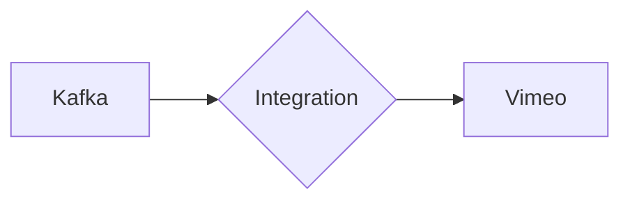

# Connect Kafka to Vimeo

Quix helps you integrate Kafka to Vimeo using pure Python.

## Vimeo

Vimeo is a video-sharing platform that allows users to upload, share, and view high-quality videos. It was founded in 2004 and has since become a popular alternative to YouTube for creators looking to showcase their work in a more professional and aesthetically pleasing manner. Vimeo offers a range of features, including the ability to customize the appearance of videos, password protect content, and embed videos on websites. It also provides a variety of tools for creators to analyze performance metrics, collaborate with others, and distribute their videos to a wider audience. Overall, Vimeo is a versatile and user-friendly platform that caters to the needs of both casual users and professional content creators.

## Integrations

Quix is a good fit for integrating with Vimeo because of its robust data processing capabilities and real-time monitoring features. Vimeo deals with a large amount of video content that needs to be processed and analyzed in real-time, making Quix Streams an ideal solution for efficiently handling this data.

With Quix Streams' Python interface and integration with libraries like Pandas, users can easily manipulate and analyze video data within Vimeo. The platform's serialization and state management support allows for efficient data handling, while its time window aggregations feature facilitates the processing of data over specific time intervals.

Additionally, the real-time monitoring tools provided by Quix Cloud enable users to track the performance of their data pipelines, ensuring that the processing of video content is seamless and efficient. This level of visibility and control is crucial for managing and optimizing the data processing workflow within Vimeo.

Overall, the streamlined development and deployment process of Quix Streams, coupled with its scalability and integration capabilities, make it a suitable choice for integrating with Vimeo and enhancing the platform's data processing capabilities.

