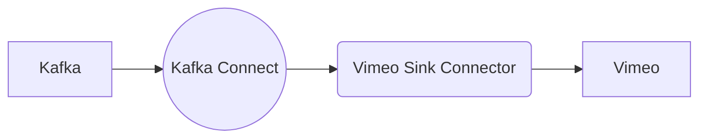

# Connect Kafka to Vimeo

Quix helps you integrate Kafka to Vimeo using pure Python.

- __Find out how we can help you integrate!__

    <a class="md-button md-button--primary" href="https://share.hsforms.com/1iW0TmZzKQMChk0lxd_tGiw4yjw2?__hstc=175542013.2303933fbd746c0ac86d9ccbe9bc9100.1728383268831.1729603416735.1729620918855.31&__hssc=175542013.1.1729620918855&__hsfp=2132701734" target="_blank" style="margin:.5rem;">Book a demo</a>

## Vimeo

Vimeo is a video-sharing platform that is known for its high-quality content and ease of use. It allows users to upload, share, and view videos in various formats, sizes, and resolutions. Vimeo offers a range of tools and features for creators, such as customizable player settings, privacy controls, and analytics to help track performance and engagement. The platform also has a strong emphasis on community and fostering connections between creators and their audience through features like comments, likes, and sharing options. Overall, Vimeo is a versatile and user-friendly technology that caters to a wide range of video content creators and viewers.

## Integrations

Quix is a good fit for integrating with Vimeo because it offers a comprehensive platform with features that streamline development, enhance collaboration, provide real-time monitoring and scaling capabilities, and support secure management of data pipelines.

Quix Cloud's integration with Git providers like GitHub and Bitbucket facilitates seamless CI/CD processes, making it easier to manage changes and updates to data pipelines. This aligns well with Vimeo's need for efficient collaboration and deployment of video content.

Furthermore, Quix Streams, a cloud-native library for processing data in Kafka using Python, can facilitate integration with Vimeo's data processing and analytics needs. The Python ecosystem integration, support for various serialization formats, and time window aggregations offered by Quix Streams can help Vimeo process and analyze video data more efficiently.

Additionally, Quix Cloud's flexible scaling and management options, as well as its support for dedicated infrastructure and historical logs visualization through Grafana dashboards, can help Vimeo handle large volumes of video data while ensuring security and compliance.

Overall, Quix's features and capabilities make it a suitable choice for integrating with Vimeo to enhance its technology infrastructure and data processing capabilities.

