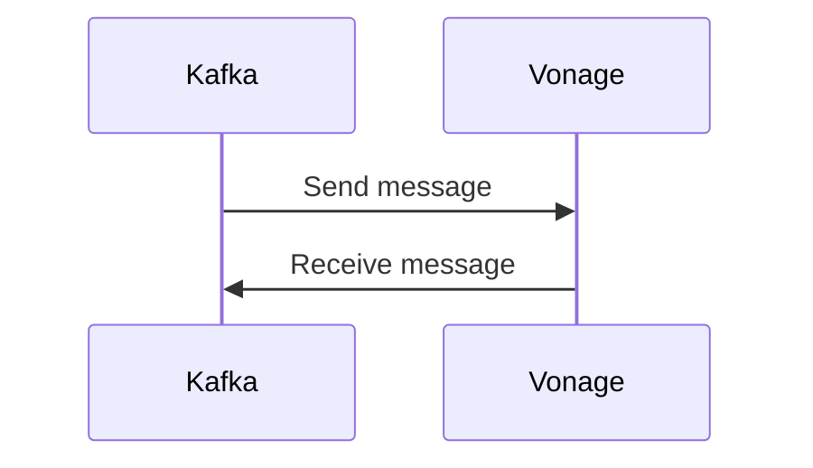

# Connect Kafka to Vonage

Quix helps you integrate Kafka to Vonage using pure Python.

## Vonage

Vonage is a telecommunications company that provides voice over internet protocol (VoIP) services to businesses and individuals. With Vonage, users are able to make phone calls through the internet rather than traditional phone lines, allowing for more flexibility and cost savings. Vonage offers a variety of features such as call forwarding, voicemail, and conferencing, all accessible through their user-friendly online portal. Additionally, Vonage provides a mobile app that allows users to make calls from their smartphones, making it easy to stay connected no matter where they are. Overall, Vonage offers a modern and convenient solution for communication needs.

## Integrations

Quix Streams and Quix Cloud are both well-suited for integrating with Vonage's technology due to their support for real-time data processing and scalability, which are key requirements for handling large volumes of communications data. Vonage offers a range of communication APIs, including voice, messaging, and video, which generate a substantial amount of data that needs to be processed and analyzed in real-time.

Quix Streams, for instance, provides a Python interface for processing data in Kafka, which can be seamlessly integrated with Vonage's communication APIs. Vonage can leverage Quix Streams' features such as serialization and state management, time window aggregations, and resilient scaling to efficiently process and analyze communication data in real-time.

On the other hand, Quix Cloud offers a comprehensive platform for developing, deploying, and managing real-time data pipelines, which can be used to streamline the development and deployment of data processing workflows for Vonage's communication data. The platform's support for real-time monitoring, flexible scaling, and data exploration and visualization can help Vonage ensure the efficient and reliable processing of their communication data.

Overall, the combination of Quix Streams and Quix Cloud provides Vonage with the necessary tools and capabilities to handle their communication data effectively, ensuring scalability, real-time processing, and analytics. By integrating with Quix's technologies, Vonage can enhance their communication services and improve their overall data processing capabilities.

