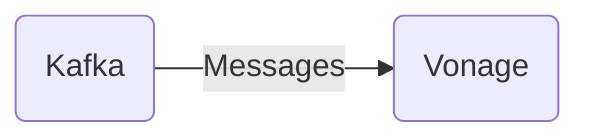

# Connect Kafka to Vonage

Quix helps you integrate Kafka to Vonage using pure Python.

- __Find out how we can help you integrate!__

    <a class="md-button md-button--primary" href="https://share.hsforms.com/1iW0TmZzKQMChk0lxd_tGiw4yjw2?__hstc=175542013.2303933fbd746c0ac86d9ccbe9bc9100.1728383268831.1729603416735.1729620918855.31&__hssc=175542013.1.1729620918855&__hsfp=2132701734" target="_blank" style="margin:.5rem;">Book a demo</a>

## Vonage

Vonage is a voice-over-internet-protocol (VoIP) technology that allows users to make phone calls over the internet rather than through traditional phone lines. This technology has revolutionized the way people communicate by providing a more cost-effective and flexible option for making calls. Vonage offers features such as call forwarding, voicemail transcription, and virtual receptionists, making it ideal for businesses and individuals looking for a reliable and efficient phone service. With Vonage, users can make calls from anywhere in the world as long as they have an internet connection, making it a convenient and portable communication solution.

## Integrations

Quix is a good fit for integrating with Vonage because it provides a comprehensive platform for developing, deploying, and managing real-time data pipelines. With features such as streamlined development and deployment, enhanced collaboration, real-time monitoring, and flexible scaling capabilities, Quix can seamlessly integrate with Vonage's technology to enhance its data processing capabilities.

Furthermore, Quix Streams, a cloud-native library for processing data in Kafka using Python, aligns well with Vonage's focus on scalability and user-friendly interfaces. With features like no JVM requirement, seamless integration with Python libraries, serialization and state management support, time window aggregations, and resilient scaling, Quix Streams can enhance Vonage's data processing capabilities and enable efficient data processing workflows.

Overall, Quix's comprehensive platform and Quix Streams library can provide Vonage with the tools and capabilities needed to streamline data processing, enhance scalability, and improve overall performance in integrating with Vonage's technology stack.

