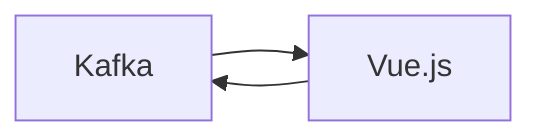

# Connect Kafka to Vue.js

Quix helps you integrate Kafka to Vue.js using pure Python.

## Vue.js

Vue.js is a progressive JavaScript framework that is commonly used for building user interfaces. It is designed to be incrementally adoptable, meaning that it can be easily integrated into existing projects without requiring a complete overhaul. Vue.js is known for its simplicity and flexibility, making it a popular choice for developers of all levels. It offers a gentle learning curve, making it easy to pick up for beginners, while still providing powerful features for more experienced developers. With its reactive data binding and efficient virtual DOM rendering, Vue.js allows for fast and responsive applications to be built with ease. Overall, Vue.js is a versatile and efficient technology that has quickly gained popularity in the web development community.

## Integrations

Vue.js is a popular JavaScript framework that is known for its flexibility, simplicity, and efficiency in building user interfaces. It is commonly used for developing single-page applications and dynamic web interfaces.

When integrating Vue.js with Quix, several factors make it a good fit:

1. Real-Time Data Processing: Vue.js is well-suited for handling real-time data updates and interactive user interfaces, which aligns perfectly with the real-time data processing capabilities of Quix Streams and Quix Cloud. Vue.js's reactivity system allows for seamless updates to the UI when new data is received or processed.

2. Streamlined Development: Just like Quix Cloud offers streamlined development and deployment features, Vue.js provides a simple and intuitive development experience. Its component-based architecture and reactive data binding make it easy to build and manage complex UI components, which can mesh well with the data processing logic implemented in Quix Streams.

3. Enhanced Collaboration: Vue.js's component-based architecture promotes code reusability and modularity, making it easier for teams to collaborate on building and maintaining data pipeline applications. Combined with Quix Cloud's collaboration features, developers can work efficiently and effectively together on real-time data projects.

4. Data Exploration and Visualization: Vue.js offers a variety of tools and libraries for data visualization, which can be integrated with Quix Streams to create interactive dashboards and visualizations of the processed data. This combination can provide users with a rich, interactive experience for exploring and analyzing data in real-time.

5. Scalability and Container Orchestration: Vue.js applications can easily scale to handle increased traffic or data processing requirements, similar to how Quix Streams is designed for resilient scaling through container orchestration. This compatibility ensures that the integrated solution can effectively manage and process data at scale.

Overall, the combination of Vue.js with Quix can provide a powerful, efficient, and user-friendly platform for developing and managing real-time data pipelines and applications. The seamless integration of these technologies can enable teams to build robust, scalable, and visually compelling solutions for processing and analyzing real-time data.

