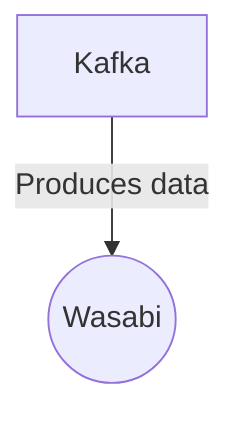

# Connect Kafka to Wasabi

Quix helps you integrate Kafka to Wasabi using pure Python.

## Wasabi

Wasabi is a revolutionary cloud storage technology that offers secure, fast, and cost-effective storage solutions for businesses and individuals. Built on a proprietary technology called single storage layer architecture, Wasabi provides an easy-to-use interface for storing and accessing large volumes of data with minimal latency. The platform boasts 11 nines of data durability and offers industry-leading download speeds, making it an ideal choice for businesses looking to streamline their data storage and access needs. With competitive pricing and no hidden fees, Wasabi is quickly gaining popularity as a reliable and efficient cloud storage solution.

## Integrations

Wasabi is a cloud storage service known for its cost-effective and high-performance object storage solutions. When integrating with Quix, Wasabi can serve as an ideal storage solution for storing and managing large volumes of data generated and processed through the real-time data pipelines.

Here's why Quix is a good fit for integrating with Wasabi:

1. Scalability and Performance: Quix Streams and Quix Cloud are designed to handle large volumes of data and process it in real-time. By using Wasabi's high-performance object storage, organizations can seamlessly scale their data storage needs without compromising on performance.

2. Cost-Effectiveness: Wasabi's storage solutions are known for their low-cost storage options, making it an attractive choice for organizations looking to optimize their storage costs. By integrating with Quix, organizations can leverage Wasabi's cost-effective storage options to store their processed data efficiently.

3. Integration Flexibility: Quix Streams and Quix Cloud offer a range of features and tools for developing, deploying, and managing real-time data pipelines. By integrating with Wasabi, organizations can easily store and manage their data generated through these pipelines, enhancing overall workflow efficiency.

4. Security and Compliance: Both Quix Streams and Quix Cloud prioritize security and compliance, ensuring that data is stored and managed securely. By integrating with Wasabi, organizations can further enhance their data security measures by leveraging Wasabi's security features and compliance standards.

Overall, integrating Quix with Wasabi can provide organizations with a robust and cost-effective solution for developing, deploying, and managing real-time data pipelines while efficiently storing and managing their data.

