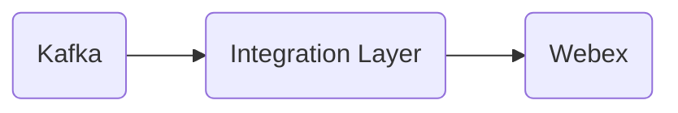

# Connect Kafka to Webex

Quix helps you integrate Kafka to Webex using pure Python.

## Webex

Webex is a web conferencing platform developed by Cisco that allows users to hold virtual meetings, webinars, and trainings with participants from all around the world. This technology enables users to share screens, host video calls, and collaborate on documents in real-time. With its easy-to-use interface and high-quality audio and video capabilities, Webex has become a popular choice for businesses and individuals looking to stay connected and productive in a remote work environment. Additionally, Webex offers features such as recording meetings, virtual backgrounds, and integration with other productivity tools, making it a versatile and powerful tool for communication and collaboration.

## Integrations

Quix Streams and Quix Cloud are both excellent choices for integrating with Webex due to their comprehensive features that complement the technology's requirements for real-time data processing and management. Here's why:

1. Streamlined Development and Deployment: Quix Cloud's integrated online code editors and CI/CD tools simplify the creation and deployment of data pipelines, making it easy to develop and deploy pipelines that can seamlessly integrate with Webex.

2. Real-Time Monitoring: The monitoring tools provided by Quix Cloud allow users to keep track of pipeline performance and critical metrics in real-time, ensuring that any issues can be addressed promptly and efficiently.

3. Enhanced Collaboration: Quix Cloud's collaboration features, such as organization and permission management, make it easier for teams to work together on developing and deploying data pipelines that are compatible with Webex.

4. Flexible Scaling and Management: With Quix Cloud, users can easily scale resources, manage CPU and memory usage, and handle multiple environments linked to Git branches, making it a flexible and customizable solution for integrating with Webex.

5. Python Ecosystem Integration: Quix Streams, with its Python interface, seamlessly integrates with libraries commonly used in Webex development, such as Pandas and scikit-learn, providing a smooth and efficient experience for Python developers working with Webex.

Overall, the combination of Quix Streams and Quix Cloud's features make them a great fit for integrating with Webex, providing a robust and user-friendly platform for developing, deploying, and managing real-time data pipelines that meet the needs of Webex technology.

