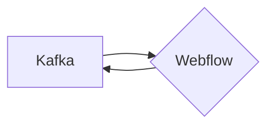

# Connect Kafka to Webflow

Quix helps you integrate Kafka to Webflow using pure Python.

## Webflow

Webflow is a powerful web design and development tool that allows users to create responsive websites without having to write any code. With its intuitive drag-and-drop interface, users can easily design and customize their websites, including animations, interactions, and layouts. Webflow also provides advanced features such as SEO optimization, e-commerce functionality, and CMS integration, making it a comprehensive solution for building professional websites. Additionally, Webflow offers hosting services, so users can publish their sites directly from the platform. Overall, Webflow is a versatile and user-friendly tool that empowers individuals and businesses to create stunning websites without the need for technical expertise.

## Integrations

Quix Streams and Quix Cloud are good fits for integrating with Webflow because both platforms offer streamlined development and deployment processes. With Quix Cloud's integrated online code editors and CI/CD tools, developers can easily create and deploy data pipelines, which can be beneficial for integrating with Webflow's web design and development platform. Additionally, Quix Cloud's real-time monitoring and scaling capabilities can help ensure the smooth operation of data pipelines and integrations with Webflow.

Quix Streams, on the other hand, offers a cloud-native library for processing data in Kafka using Python. This can be advantageous for integrating with Webflow as Python is a popular programming language in web development and can seamlessly interact with Webflow's APIs. Furthermore, Quix Streams' support for serialization formats and time window aggregations aligns well with the data processing requirements often encountered when integrating with web platforms like Webflow.

Overall, the features and capabilities provided by Quix Streams and Quix Cloud make them well-suited for integrating with technology like Webflow, enabling developers to efficiently create, deploy, and manage real-time data pipelines for enhanced collaboration and monitoring.

