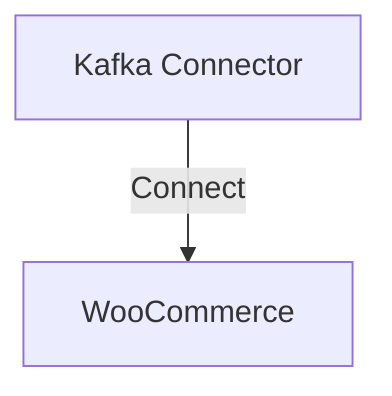

# Connect Kafka to WooCommerce

Quix helps you integrate Kafka to WooCommerce using pure Python.

## WooCommerce

WooCommerce is a powerful and customizable technology solution that allows users to create and manage their own online stores. Developed as a plugin for WordPress, WooCommerce provides a seamless integration that enables businesses to easily set up and operate e-commerce platforms. With a wide range of features such as product management, payment processing, and inventory tracking, WooCommerce offers a user-friendly interface that simplifies the process of running an online store. Additionally, the technology supports various customization options and extensions, making it easy for businesses to tailor their online stores to meet their specific needs and preferences. Overall, WooCommerce is a versatile and reliable e-commerce solution that empowers businesses to establish a strong online presence and grow their sales effectively.

## Integrations

Quix is a good fit for integrating with WooCommerce because of its robust features that streamline development, enhance collaboration, and provide real-time monitoring and scaling capabilities. 

1. Streamlined Development and Deployment: Quix Cloud's integrated online code editors and CI/CD tools simplify the creation and deployment of data pipelines, making it easy to integrate with WooCommerce's technology stack.

2. Enhanced Collaboration: With organization and permission management features, Quix Cloud promotes efficient collaboration among team members, increasing visibility and control over the project. This is essential when integrating with WooCommerce's complex ecosystem.

3. Real-Time Monitoring: The platform offers tools for real-time monitoring of pipeline performance and critical metrics, ensuring the seamless integration of WooCommerce data into the pipelines.

4. Flexible Scaling and Management: Quix Cloud allows users to easily scale resources, manage CPU and memory, and handle multiple environments, which is crucial when integrating with WooCommerce's high volume of data.

5. Security and Compliance: Quix Cloud ensures the secure management of secrets and compliance with dedicated infrastructure options and SLAs, meeting the security requirements of the WooCommerce platform.

Overall, Quix provides the necessary tools and capabilities to effectively integrate with WooCommerce, enabling businesses to streamline their data processing workflows, enhance collaboration, and achieve real-time monitoring and scaling capabilities.

