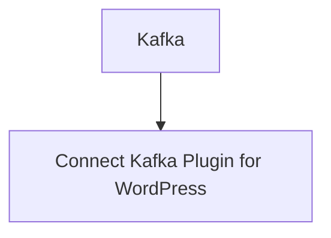

# Connect Kafka to WordPress

Quix helps you integrate Kafka to WordPress using pure Python.

## WordPress

WordPress is a powerful and versatile content management system (CMS) that allows users to create, manage, and publish websites and blogs with ease. It offers a wide range of customizable themes, plugins, and features that can be tailored to suit individual needs and preferences. With its user-friendly interface and intuitive design tools, WordPress has become one of the most popular website creation platforms in the world. It allows users to easily add and edit content, upload media, and customize their site's appearance without the need for advanced programming knowledge. Whether you're a beginner looking to create a personal blog or a business owner in need of a professional website, WordPress offers the flexibility and scalability to meet your needs.

## Integrations

Quix is a good fit for integrating with WordPress because it provides a comprehensive platform for developing and managing real-time data pipelines. WordPress websites generate a large amount of data that needs to be processed and analyzed in real-time. By using Quix, WordPress users can streamline the development and deployment of data pipelines, enhance collaboration among team members, and monitor pipeline performance in real-time.

The integrated online code editors and CI/CD tools provided by Quix Cloud make it easy to create and deploy data pipelines for processing data generated by WordPress websites. Additionally, the platform supports efficient collaboration with organization and permission management features, making it easier for teams to work together on data processing projects.

With tools for real-time monitoring and scaling capabilities, Quix Cloud allows users to keep track of pipeline performance and scale resources as needed. This is particularly important for WordPress websites that experience fluctuations in data volume and traffic.

Furthermore, Quix Cloud ensures secure management of secrets and compliance with dedicated infrastructure options, which is crucial for WordPress users who need to protect sensitive data and ensure regulatory compliance.

Overall, the features offered by Quix make it a great fit for integrating with WordPress, as it provides the necessary tools and capabilities to effectively process and analyze data generated by WordPress websites in real-time.

