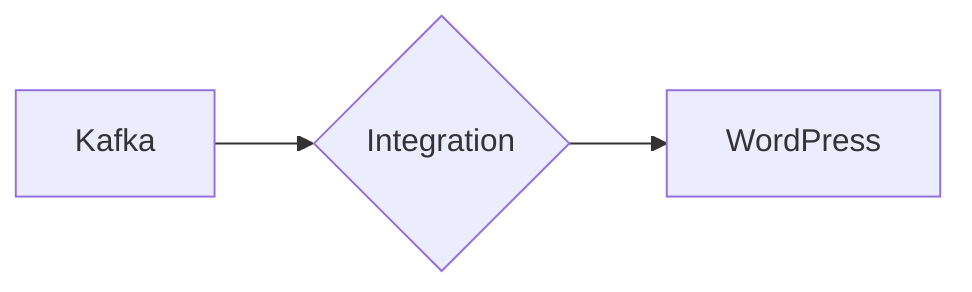

# Connect Kafka to WordPress

Quix helps you integrate Kafka to WordPress using pure Python.

- __Find out how we can help you integrate!__

    <a class="md-button md-button--primary" href="https://share.hsforms.com/1iW0TmZzKQMChk0lxd_tGiw4yjw2?__hstc=175542013.2303933fbd746c0ac86d9ccbe9bc9100.1728383268831.1729603416735.1729620918855.31&__hssc=175542013.1.1729620918855&__hsfp=2132701734" target="_blank" style="margin:.5rem;">Book a demo</a>

## WordPress

WordPress is a popular content management system that allows users to create and manage websites with ease. It provides a user-friendly interface that makes it simple to customize the look and feel of a website without requiring advanced coding knowledge. WordPress also offers a wide range of plugins and themes that can be easily added to extend the functionality and design of a website. With its flexibility and scalability, WordPress is utilized by individuals, businesses, and organizations worldwide to create professional and engaging websites. Overall, WordPress is a powerful and versatile technology that empowers users to create dynamic and visually appealing websites.

## Integrations

Quix is a good fit for integrating with WordPress because of its robust development and deployment features, enhanced collaboration tools, real-time monitoring capabilities, flexible scaling and management options, security and compliance measures, and comprehensive development tools. 

With Quix's streamlined development and deployment capabilities, WordPress developers can easily create and deploy data pipelines for their websites. The platform's enhanced collaboration features ensure efficient teamwork and project visibility, which is essential for managing a WordPress site effectively.

The real-time monitoring tools provided by Quix allow users to keep track of pipeline performance and critical metrics, which is crucial for maintaining the stability and performance of a WordPress website. Additionally, the platform's flexible scaling and management options make it easy to adjust resources as needed and manage multiple environments linked to Git branches.

Quix's focus on security and compliance ensures that sensitive data is managed securely, which is essential for any website, especially one built on a platform like WordPress. The platform's integration with various data sources and sinks, as well as support for DevContainers, enhances workflows and productivity for WordPress developers.

Overall, Quix's comprehensive feature set, including its integration with Kafka through Quix Streams, makes it a valuable tool for developers working with WordPress websites. By utilizing Quix's capabilities, WordPress developers can streamline their development process, enhance collaboration, monitor performance in real-time, and scale resources effectively, ultimately improving the overall functionality and performance of their websites.

