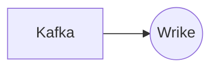

# Connect Kafka to Wrike

Quix helps you integrate Kafka to Wrike using pure Python.

## Wrike

Wrike is a cloud-based project management and collaboration platform that allows teams to plan, track, and manage their work in real-time. With features such as task assignment, Gantt charts, and customizable dashboards, Wrike helps teams streamline their workflows and stay organized. Users can communicate with team members, share files, and set deadlines all within the platform, making it easy to stay on top of project progress and collaborate effectively. Wrike also integrates with other popular tools such as Microsoft Office, Google Drive, and Slack, allowing for seamless workflow management across different platforms. Overall, Wrike is a comprehensive and user-friendly solution for teams looking to improve their project management processes.

## Integrations

Wrike is a project management and collaboration platform that enables teams to work more efficiently and effectively. By integrating with Quix, Wrike users can leverage the advanced features and capabilities of these platforms to enhance their data processing and pipeline management workflows.

One key advantage of integrating with Quix Streams is its seamless integration with Kafka, a widely used real-time data streaming platform. This allows Wrike users to process and analyze data in real-time, enabling them to make faster and more informed decisions. The cloud-native nature of Quix Streams also ensures scalability and flexibility, which are essential for handling large volumes of data.

Additionally, Quix Streams' Python interface makes it easy for developers and data engineers familiar with the Python ecosystem to work with the platform. This integration allows Wrike users to leverage their existing skills and tools, such as Pandas, scikit-learn, and TensorFlow, to process and analyze data efficiently.

Moreover, Quix Cloud's features for streamlined development and deployment, enhanced collaboration, and real-time monitoring align well with Wrike's project management capabilities. The platform's support for efficient collaboration and organization management can help teams working on data pipelines in Wrike stay organized and on track. Real-time monitoring tools in Quix Cloud also provide valuable insights into pipeline performance, enabling teams to optimize and improve their workflows.

In summary, Quix Streams and Quix Cloud are well-suited for integrating with Wrike due to their advanced features for real-time data processing, scalability, and collaboration. By leveraging these platforms, Wrike users can enhance their data management workflows and drive better business outcomes.

