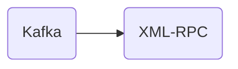

# Connect Kafka to XML-RPC

Quix helps you integrate Kafka to XML-RPC using pure Python.

<a class="md-button md-button--primary" href="https://share.hsforms.com/1iW0TmZzKQMChk0lxd_tGiw4yjw2?__hstc=175542013.2303933fbd746c0ac86d9ccbe9bc9100.1728383268831.1729603416735.1729620918855.31&__hssc=175542013.1.1729620918855&__hsfp=2132701734" target="_blank" style="margin-right:.5rem;">Book a demo</a>
 

## XML-RPC

XML-RPC, or Extensible Markup Language Remote Procedure Call, is a protocol that allows for communication between different systems over the internet. It uses XML to encode data and HTTP as the transport mechanism. XML-RPC allows for remote procedure calls, where a client system can invoke methods or functions on a remote server and receive the results back. This technology is widely used for integrating different applications and systems, as well as enabling interoperability between different programming languages. XML-RPC is simple, lightweight, and easy to implement, making it a popular choice for web services and APIs.

## Integrations

Quix is a good fit for integrating with XML-RPC technology because of its diverse set of features that align well with the requirements and capabilities of XML-RPC.  

Firstly, Quix Cloud's streamlined development and deployment capabilities, including online code editors and CI/CD tools, can help simplify the integration process with XML-RPC by providing an efficient way to develop and deploy data pipelines.

Secondly, the platform's real-time monitoring tools can be beneficial for keeping track of XML-RPC requests and responses, ensuring that the integration is running smoothly and efficiently.

Additionally, Quix Cloud's flexibility in scaling resources and managing environments can support the scalability requirements of XML-RPC, allowing users to easily adjust resources as needed.

Furthermore, Quix Streams' ability to process data in Kafka using Python can be a valuable asset for incorporating XML-RPC data into existing pipelines, as it provides seamless integration with Python libraries and efficient serialization and state management capabilities.

Overall, Quix's comprehensive platform and support for real-time data processing make it a suitable choice for integrating with XML-RPC technology, offering the necessary tools and features to streamline the process and enhance overall performance.

