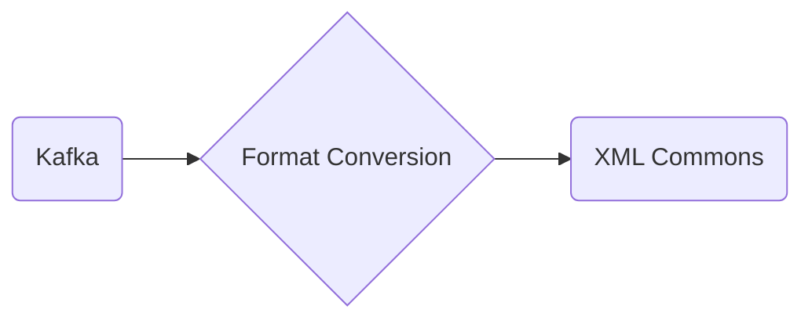

# Connect Kafka to XML Commons

Quix helps you integrate Kafka to XML Commons using pure Python.

<a class="md-button md-button--primary" href="https://share.hsforms.com/1iW0TmZzKQMChk0lxd_tGiw4yjw2?__hstc=175542013.2303933fbd746c0ac86d9ccbe9bc9100.1728383268831.1729603416735.1729620918855.31&__hssc=175542013.1.1729620918855&__hsfp=2132701734" target="_blank" style="margin-right:.5rem;">Book a demo</a>
 

## XML Commons

XML Commons is an open-source technology that provides a shared library of XML code and resources for developers to use across various projects and applications. By using XML Commons, developers can avoid duplicating code and ensure consistency in the way XML data is structured and handled. This technology enhances interoperability and promotes reuse of XML resources, making it easier to work with and manipulate XML documents in a standardized manner. XML Commons is a valuable tool for streamlining development processes, reducing errors, and improving the overall efficiency of working with XML data.

## Integrations

Quix is a good fit for integrating with XML Commons because of its comprehensive platform designed for developing, deploying, and managing real-time data pipelines. XML Commons is a technology that provides a way to manage and manipulate XML documents, making it easy to integrate different systems that use XML as a data format.

Quix offers streamlined development and deployment features, such as integrated online code editors and CI/CD tools, which can help developers easily work with XML Commons and create efficient data pipelines. The platform also supports enhanced collaboration with organization and permission management, allowing teams to efficiently work together on XML data processing tasks.

Additionally, Quix provides real-time monitoring and scaling capabilities, which can be crucial when working with XML data that needs to be processed and analyzed in a timely manner. Its flexible scaling and management options can help ensure that XML data pipelines run smoothly and can handle varying workloads effectively.

Furthermore, Quix's integration with Git providers like GitHub and Bitbucket can facilitate seamless CI/CD processes for XML data pipelines, ensuring that changes are managed and deployed efficiently. Its support for Kafka integration can also be valuable when working with XML data streams that need to be processed in real-time.

Overall, Quix's features and capabilities make it a strong fit for integrating with XML Commons, providing a powerful platform for developing, deploying, and managing XML data pipelines effectively and efficiently.

