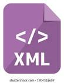
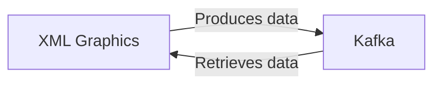

# Connect Kafka to XML Graphics

Quix helps you integrate Kafka to XML Graphics using pure Python.

<a class="md-button md-button--primary" href="https://share.hsforms.com/1iW0TmZzKQMChk0lxd_tGiw4yjw2?__hstc=175542013.2303933fbd746c0ac86d9ccbe9bc9100.1728383268831.1729603416735.1729620918855.31&__hssc=175542013.1.1729620918855&__hsfp=2132701734" target="_blank" style="margin-right:.5rem;">Book a demo</a>
 

## XML Graphics

XML Graphics is a technology that allows for the creation and manipulation of graphical images using XML-based languages. By using XML to define the structure and content of an image, developers can easily generate complex graphics with text, shapes, colors, and other visual elements. XML Graphics also allows for scalable vector graphics, meaning that images can be resized without losing quality. This technology is particularly useful for web development, as it provides a lightweight and portable way to display graphics across different platforms and devices. With XML Graphics, developers can create dynamic and interactive visual content that enhances the user experience on websites and applications.

## Integrations

Quix is a good fit for integrating with XML Graphics because of its comprehensive platform features that streamline development, enhance collaboration, provide real-time monitoring and scaling capabilities, and ensure security and compliance. 

1. Streamlined Development and Deployment: Quix Cloud's integrated online code editors and CI/CD tools simplify the creation and deployment of data pipelines. This capability can be leveraged to efficiently integrate with XML Graphics and streamline the development process.

2. Flexible Scaling and Management: Quix Cloud allows users to easily scale resources and manage CPU and memory, which can be beneficial for handling large amounts of data processing involved in XML Graphics.

3. Real-Time Monitoring: With tools for real-time logs, metrics, and data exploration, Quix Cloud enables users to monitor pipeline performance and critical metrics. This real-time monitoring capability is essential for ensuring smooth integration with XML Graphics.

4. Collaboration and Security: Quix Cloud supports efficient collaboration with organization and permission management, enhancing project visibility and control. Its secure management of secrets and compliance with dedicated infrastructure options make it a suitable platform for integrating with sensitive technologies like XML Graphics.

5. Development Tools: Quix Cloud provides online code editors, code templates, and connectors for various data sources and sinks, supporting enhanced workflows for developing and integrating with XML Graphics.

In addition, Quix Streams, a cloud-native library for processing data in Kafka using Python, offers key benefits such as Python ecosystem integration, serialization and state management support, time window aggregations, and resilient scaling. These features can further enhance the integration of Quix with XML Graphics, allowing for efficient and scalable data processing.

